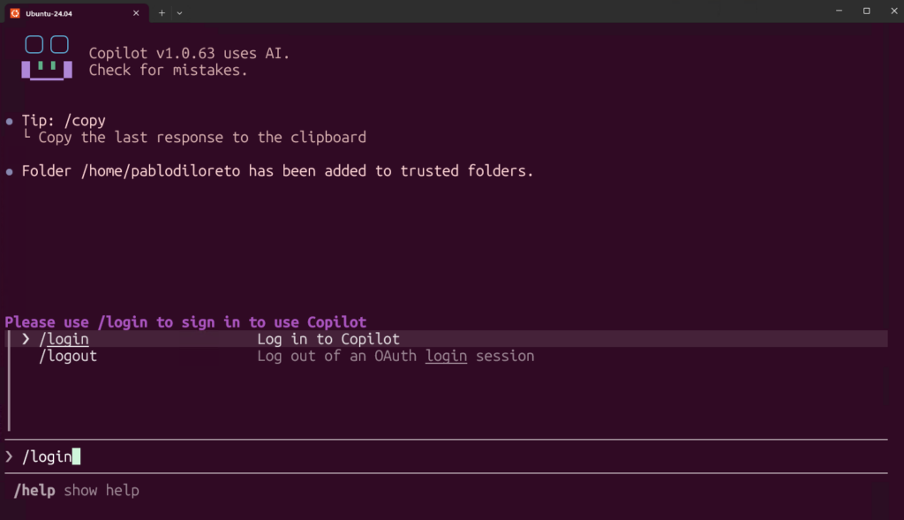
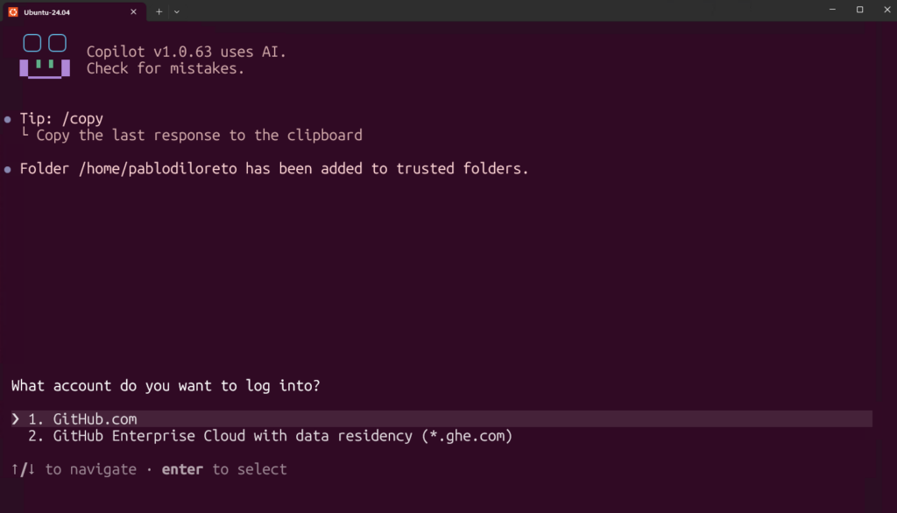
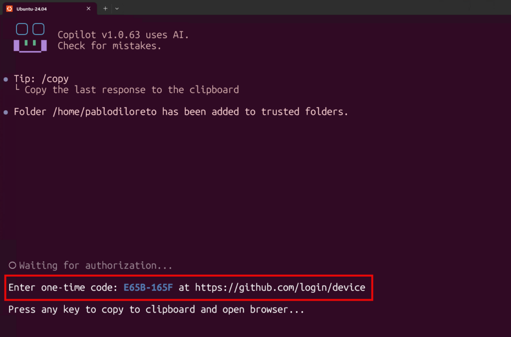
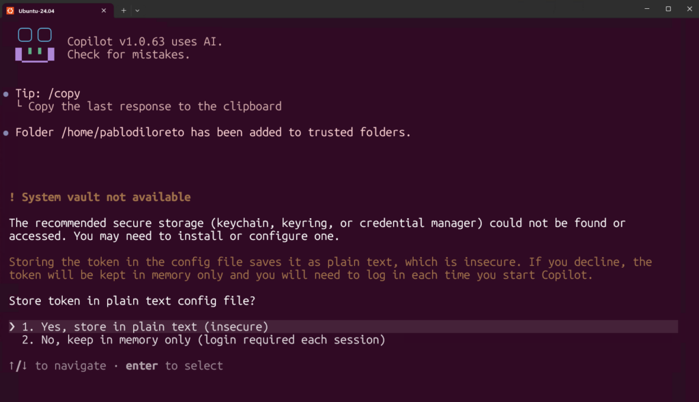

# Alta y setup de GitHub Copilot

En este curso usamos **GitHub Copilot desde la terminal**, con su **CLI** (no el chat dentro de VS Code). ¿Por qué? Porque así manejás los **tres agentes** — Claude Code, Copilot y OpenCode — de la misma forma: desde la terminal, con el mismo flujo agéntico. Más coherente y más potente. 🧑‍💻

## 📥 Paso 1: instalar el Copilot CLI

En este laboratorio vamos a instalar **GitHub Copilot CLI** usando el instalador para Linux/macOS:

```
curl -fsSL https://gh.io/copilot-install | bash
```

Cuando termine, cerrá y reabrí la terminal. Después verificá la instalación:

```
copilot --version
```

Si ves un número de versión, está instalado correctamente ✅.

> 💡 GitHub Copilot CLI también puede instalarse con `npm`, `Homebrew`, `WinGet` o descargando el ejecutable manualmente. En este curso usamos el instalador por `curl` porque es el camino más simple para Linux/WSL y evita problemas típicos de permisos con instalaciones globales de npm.

## 🔑 Paso 2: iniciar sesión con GitHub

Arrancá Copilot escribiendo:

```
copilot
```

La **primera vez** te va a pedir **autenticarte con tu cuenta de GitHub** (la que tiene **Copilot activo**). Deberás ejecutar en el espacio de chat lo siguiente:

```
/login
```



Y deberás elegir la opción «github.com»:



Y luego deberás seguir las instrucciones de la pantalla (ingresar a una URL y poner el código luego de autenticarte a GitHub):



Autoriza el uso de GitHub en la pantalla de consentimiento.

> 💡 SI ESTAS EN WSL: Puede que te aparezca alguna validación de seguridad (relacionada con store token) como la siguiente:



Esto es porque en WSL GitHub Copilot no puede guardar de manera segura el token de acceso a GitHub. Si preferís priorizar la seguridad y no alojar tu token de GitHub en texto plano, deberás hacer esta autorización (ingresar el código) cada vez que quieras usar Copilot. Si eso para vos no es un problema, podrás seleccionar la opción 1 hasta que termine el curso (GitHub Copilot no te volverá a pedir iniciar sesión en GitHub usando WSL).

## ⚡ Paso 3: conocé los modos (Plan y Autopilot)

Copilot CLI trabaja en **modos agénticos**, y con **`Shift + Tab`** vas cambiando entre ellos:

- **Plan:** Copilot te propone primero un plan, antes de tocar nada. Ideal para revisar la idea antes de que se mande.
- **Autopilot:** Copilot avanza con la tarea sin pedirte aprobación a cada paso.

Y con el comando **`/model`** elegís qué modelo usa (por defecto viene con un modelo Claude). No hace falta que toques nada de esto ahora — solo que sepas que está.

## ✅ Paso 4: probarlo

En una carpeta de prueba:

```
mkdir ~/copilot-test
cd ~/copilot-test
copilot
```

Pedile algo simple en lenguaje normal: *«creá un archivo hola.js que imprima un saludo por consola»*. Si propone el cambio y crea el archivo, **está andando** 🎉. Esa carpeta la borrás cuando quieras.

> 🧩 **¿Y el `copilot-instructions.md`?** Igual que con los otros agentes: Copilot lee un archivo de instrucciones del proyecto, pero **eso se crea dentro del repo de cada módulo**, no acá.

## 🆘 Si algo no sale

- *«command not found: copilot»* → reabrí la terminal; si sigue, revisá que Node/npm estén bien (lección de dependencias) y reintentá el Paso 1.
- *«command not found: npm»* → te falta Node; volvé a la lección de dependencias.
- *Login rechazado o «no tenés Copilot»* → asegurate de usar la cuenta de GitHub con la **suscripción de Copilot activa**.

Copilot andando desde la terminal. Nos queda el tercer agente: **OpenCode**. ➡️
