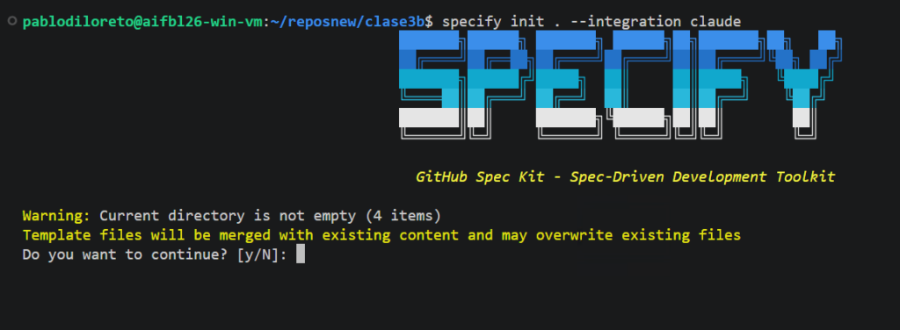
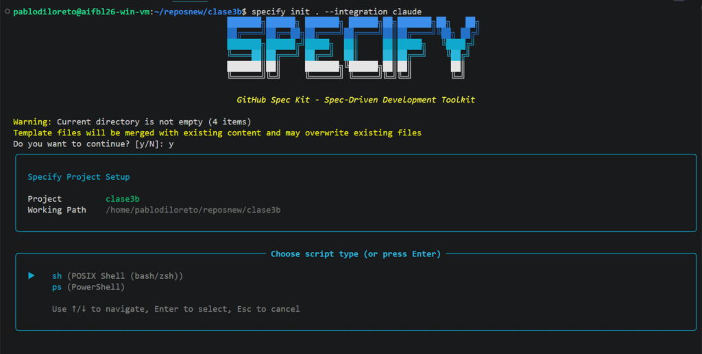
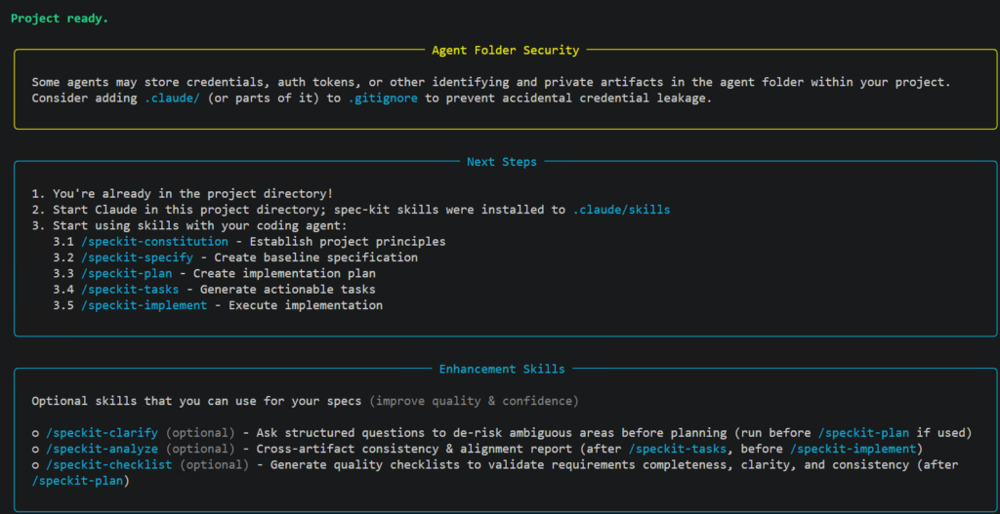

# Ejercicio guiado: Creá el repo de M4 e inicializá Spec Kit

Llegó la primera lección con las manos en la masa. Antes de escribir un solo spec, necesitamos un lugar donde trabajar, con lo justo y necesario adentro, y la herramienta lista. Buenas noticias: la mitad ya está hecha —el **CLI de Spec Kit lo instalaste en «Prepará tu entorno»**, junto con los tres agentes—. Así que hoy el trabajo es rápido, pero hay que hacerlo con precisión: no todo lo de M2-M3 se trata igual en este repo nuevo, y conviene que sepas bien qué cruza y cómo. 🛠️

## 🗂️ Un repo nuevo, la misma app

Como en cada módulo, esta es **una vuelta nueva sobre tu proyecto**, en su **propio repo**. No reutilizamos el de M2-M3: ahí improvisaste con el código; acá vas a dirigir desde un spec. Lo que se reconstruye de cero es **el código** —esa es la variable que este módulo compara—. Todo lo demás, el conocimiento que ya validaste sobre tu proyecto, no se tira: se lleva.

## 🧳 Qué te llevás de M2-M3 (y cómo)

Un repo nuevo es, otra vez, una **carpeta pelada**: como viste en M2, un agente sin contexto es un compañero nuevo al que no le hiciste el onboarding. La diferencia con M2 es que esta vez **no arrancás de cero**: ya tenés conocimiento y herramientas tuyas, ya probadas, y la regla es simple —**se copian tal cual, no se rehacen**—:

- **`PRD2.md`** — la versión final del PRD que armaste en M3 con tu skill `create-prd` (si por algún motivo no llegaste a esa versión, copiá tu `PRD.md` de M1). Es el contrato de producto: lo vas a necesitar en la próxima-próxima lección para generar el spec.
- **Tu guardrail (`AGENTS.md` / `CLAUDE.md`)** — con su sección «Stack» incluida. **No lo reescribís de cero**: ya lo validaste en M2, ya sabés que dice lo que tiene que decir. Copialo tal cual.
- **Tu carpeta `.claude/skills/`** — los skills que armaste en M3 (`create-prd`, `conventional-commit`) viven **a nivel de proyecto**, no global: si no los copiás, en este repo nuevo **no existen**. Copiá la carpeta entera y los vas a tener disponibles acá también.

¿Por qué copiar y no rehacer? Porque esto no es «aceptar output de una IA sin revisar» —eso sí sería un error, y es justo lo que este curso te enseña a no hacer—. Esto es **reusar tu propio trabajo, ya escrito y ya validado por vos**. Rehacerlo de cero no te enseñaría nada nuevo, solo te haría perder tiempo. Y hay un beneficio extra de copiar en vez de rehacer: como tu `AGENTS.md` ya trae el mismo Stack de siempre, cuando más adelante generes el plan técnico, vas a estar comparando tu app construida con SDD contra la misma base tecnológica de M2-M3 — la comparación entre métodos queda limpia.

Ahora, lo que **sí es distinto** en este repo:

- **Totalmente nuevo, nace acá: la constitución.** No existe en M2 ni en M3 —la vas a escribir en la lección de acá a dos—. No reemplaza al guardrail: convive con él (ya vas a ver la diferencia con calma).
- **Se reconstruye de cero: el código.** Nada de la app v1/v2 de M2-M3 se copia a este repo. Vas a construir la funcionalidad de nuevo, esta vez dirigida por el flujo de Spec Kit.

## ⚙️ `specify init`: qué hace

Una vez que tenés el repo con `git init` y adentro tu `PRD2.md` (o el nombre que le hayas puesto), tu guardrail y tu carpeta de skills copiados, inicializás Spec Kit ahí mismo con un comando, diciéndole **qué agente vas a usar**. En el momento de inicializar el Spec Kit en el proyecto debemos elegir nuestro LLM, en este caso vamos a trabajar sobre Claude.

El comando exacto es:

```
specify init . --integration claude
```



- El `.` le dice a Spec Kit «inicializá acá, en la carpeta donde estoy parado» (así no te pisa lo que ya copiaste).
- El `--integration claude` es lo que elige **Claude Code** como agente.
- Como Spec Kit es agnóstico, ahí podrías poner `copilot`, `opencode`, `codex`, etc. — el flujo es idéntico, solo cambia ese valor. Nosotros vamos a elegir Claude. (Dos detalles: si no pasás `--integration`, Spec Kit usa **Copilot** por defecto, por eso lo ponemos explícito; y si en vez de `.` le pasás un nombre —`specify init ticketriage-sdd --integration claude`—, Spec Kit crea esa carpeta por vos y inicializa adentro. Cualquiera de las dos formas sirve; en este módulo usamos `.` porque ya creaste el repo vos mismo.)

Luego debemos elegir «y» para continuar eligiendo preferentemente bash como consola:



Y la inicialización tendrá lugar:



Con eso, Spec Kit prepara el terreno:

- Crea una carpeta **`.specify/`** — es el **motor** del flujo: ahí vive la constitución (`.specify/memory/constitution.md`), los templates y los scripts que usan los comandos. Todavía no hay ningún spec adentro.
- Instala los **comandos `/speckit.*`** dentro de tu agente.

Cuando termina, lo único que verificás es que, al abrir tu agente, aparezcan los comandos `/speckit.constitution`, `/speckit.specify`, `/speckit.plan` y compañía. Si están, estás listo para dirigir desde el spec.

### 🔍 Bajo el capó (opcional): ¿y dónde vive cada spec?

Si te preguntás dónde van a parar el spec, el plan y las tareas que vas a generar en las próximas lecciones: **no van dentro de `.specify/`**. Cada feature que arrancás con `/speckit.specify` crea su **propia carpeta numerada** en la raíz del repo (algo como `specs/001-clasificacion-de-tickets/`, con su `spec.md`, `plan.md` y `tasks.md` adentro), atada a su propia rama de Git. Spec Kit sabe en qué feature estás trabajando **por la rama en la que estás parado** — por eso, cuando más adelante tengas más de una feature, vas a ver que cada una vive prolijamente separada de las demás, con su propio historial. Para el proyecto integrador de este módulo con una sola feature no lo vas a notar, pero es bueno que sepas que está ahí: `.specify/` es el motor, `specs/00N-.../` es cada feature construida con ese motor.

## 🛠️ Tu turno: dejá el repo de M4 listo

⏱️ **Tiempo estimado:** ~15 min · 📦 **Entregable:** el repo de M4 con `PRD2.md` + guardrail + skills copiados, y Spec Kit inicializado.

1. **Creá la carpeta del repo de M4** (local + en GitHub si querés) y corré `git init` — es la segunda vuelta de tu app, ahora con SDD.
2. **Copiá tal cual** a esta carpeta nueva: tu `PRD2.md` (o `PRD.md` si no llegaste al skill), tu `AGENTS.md` + `CLAUDE.md`, y tu carpeta `.claude/skills/`.
3. **Inicializá Spec Kit:** `specify init . --integration claude` (o cambiá `claude` por el agente que prefieras).
4. **Verificá** que se creó la carpeta `.specify/` y que en tu agente aparecen los comandos `/speckit.*`.

> ✅ **Lo lograste cuando** tu repo de M4 tiene `PRD2.md` + `AGENTS.md`/`CLAUDE.md` + `.claude/skills/` (los tres, copiados de M2-M3) + `.specify/` con los comandos `/speckit.*` disponibles.

### 🔎 La muestra: TicketTriage

Para la app de ejemplo arrancamos así su segunda vuelta:

```
mkdir ticketriage-sdd && cd ticketriage-sdd
git init
# copiamos tal cual el conocimiento validado de M2-M3 — nada se rehace
cp ../tickettriage/PRD2.md .
cp ../tickettriage/AGENTS.md ../tickettriage/CLAUDE.md .
cp -r ../tickettriage/.claude/skills .claude/skills
specify init . --integration claude   # agnóstico: podrías usar copilot, opencode, etc.
```

Spec Kit deja la carpeta `.specify/` y, al abrir Claude Code en el repo, aparecen los `/speckit.`*. Fijate que el nombre del repo (`ticketriage-sdd`) deja claro que es* la misma app, otra vuelta, otro método* — no se pisa con el de M2-M3, pero el `PRD2.md`, el guardrail (con su mismo Stack) y los skills viajaron intactos.

Con el repo listo y los comandos a mano, antes de meternos en cada fase conviene ver **el flujo completo de un vistazo**, para saber a dónde vamos. ➡️
