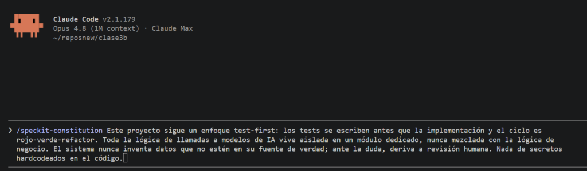

# Ejercicio guiado: La constitución del proyecto

Arrancamos el flujo por su primera piedra: la **constitución**. Es el comando `/speckit.constitution`, y antes de escribir un solo spec conviene tenerla, porque marca las reglas del juego de todo lo que venga después. 📜

## 🏛️ Qué es la constitución

La constitución son los **principios persistentes de tu proyecto**: las decisiones de proceso y de arquitectura que valen *siempre*, en toda feature que construyas — no una feature puntual, sino la forma en la que **todo** el proyecto se construye. Vive en `.specify/memory/constitution.md`, y el agente la tiene en cuenta en cada fase del flujo: cosas como «los tests van antes que la implementación», «toda la lógica de IA se aísla en un módulo dedicado», «nunca inventar datos que no estén en la fuente», o directamente una postura de arquitectura («este proyecto es library-first» o «usamos microservicios») si tu proyecto lo amerita.

Si esto te suena, es porque se parece al **guardrail que acabás de copiar en la lección anterior** (`AGENTS.md`/`CLAUDE.md`, de M2) —y la conexión es justa, pero hay un matiz que conviene tener claro—. El guardrail es *cómo se comporta el agente en general* (incluye cosas operativas como tu stack y cómo correr el proyecto); la constitución es *los principios de diseño de este proyecto* que el flujo SDD respeta en cada feature (no repite el stack, no lo pisa). Pensalo así: el guardrail es el manual de convivencia; la constitución es la carta magna del proyecto. Son archivos distintos, con trabajos distintos, y conviven sin pisarse. En la próxima lección vas a ver *exactamente* para qué sirve esta constitución más allá de estar escrita: Spec Kit la usa como un filtro real sobre tus decisiones técnicas, no como un documento decorativo.

## ✍️ Cómo se escribe

No la redactás a mano de cero, y no hace falta ningún archivo previo: **le contás tus principios directamente como argumento del comando**, en lenguaje natural, igual que vas a hacer con `/speckit-specify` y `/speckit-plan` más adelante. Por ejemplo:

```
/speckit-constitution Este proyecto sigue un enfoque test-first: los tests se escriben
antes que la implementación y el ciclo es rojo-verde-refactor. Toda la lógica de
llamadas a modelos de IA vive aislada en un módulo dedicado, nunca mezclada con la
lógica de negocio. El sistema nunca inventa datos que no estén en su fuente de verdad;
ante la duda, deriva a revisión humana. Nada de secretos hardcodeados en el código.
```

El agente toma ese texto, lo estructura sobre un template interno (`.specify/templates/constitution-template.md`) y lo guarda en `.specify/memory/constitution.md` como una lista prolija de principios con nombre y justificación. Un detalle que vale la pena conocer: la constitución tiene **versión** (como `1.0.0`) y cada vez que la modificás con el mismo comando, Spec Kit decide si el cambio es menor (una aclaración) o mayor (agregaste o sacaste un principio) y actualiza el número — es un documento de gobierno vivo, no algo que se escribe una vez y se olvida.

Después la revisás —es tuya, podés ajustarla— y queda como referencia para todo el módulo. La idea no es escribir veinte mandamientos, sino los pocos principios que de verdad no querés que se violen: si escribís diez y la mitad son obviedades («escribir buen código»), le estás restando peso a los que sí importan.

## 🛠️ Tu turno: escribí la constitución de tu proyecto

⏱️ **Tiempo estimado:** ~20 min · 📦 **Entregable:** `.specify/memory/constitution.md` con los principios de tu proyecto.



1. En el repo de M4, pensá **entre 3 y 5 principios** que valgan para todo tu proyecto (calidad, seguridad, estructura, testing — lo que importe en TU app).
2. Corré **`/speckit-constitution`** pasándole esos principios como argumento, en lenguaje natural.
3. Revisá lo que escribió: ¿son principios reales o relleno? Sacá lo que no aporte.
4. Confirmá y dejá la constitución en `.specify/memory/`.

> ✅ **Lo lograste cuando** tenés una constitución corta y honesta, con principios que de verdad querés que el agente respete en cada feature.

### 🔎 La muestra: la constitución de TicketTriage

Así la generamos para la app de ejemplo:

```
/speckit-constitution TicketTriage sigue estos principios: toda la lógica de IA
vive aislada en un módulo dedicado, nunca mezclada con la lógica de negocio; el
borrador de respuesta nunca afirma datos que no estén en la KB, ante la duda deriva
a un humano; la lógica de clasificación se desarrolla test-first; nada de secretos
en el código, las credenciales van en variables de entorno; no se agregan features
fuera del PRD vigente.
```

Y quedó estructurada así:

```
# TicketTriage Constitution

## Core Principles

### I. Test-First (INNEGOCIABLE)

El desarrollo sigue TDD de forma estricta. Para toda unidad de lógica nueva o
modificada, los tests se escriben ANTES que la implementación, deben FALLAR
primero (rojo), luego se implementa lo mínimo para que pasen (verde) y recién
después se refactoriza (refactor). No se admite código de producción sin un test
que lo cubra y que haya fallado previamente.

**Rationale**: El ciclo rojo-verde-refactor garantiza que cada línea existe para
satisfacer un comportamiento verificable y evita regresiones en un sistema donde
la clasificación y los borradores impactan a usuarios reales.

### II. Aislamiento de la IA

Toda la lógica de llamadas a modelos de IA (construcción de prompts, invocación
del cliente de Claude, parseo de respuestas) vive en un módulo dedicado y
aislado. La lógica de negocio (CRUD de tickets, reglas de triage, persistencia)
NUNCA invoca a la API directamente ni mezcla detalles del proveedor con sus
propias reglas. El resto del sistema consume la IA a través de una interfaz
estable, sustituible por un mock en tests.

**Rationale**: Aislar el proveedor permite testear sin llamar a la API real,
cambiar de modelo sin tocar el negocio y razonar sobre el sistema con fronteras
claras.

### III. Fidelidad a la Fuente de Verdad

El sistema NUNCA inventa información. Un borrador de respuesta solo puede afirmar
lo que está respaldado por la fuente de verdad (`kb.md`). Si la información no
está presente o hay ambigüedad, el sistema NO especula: deriva el caso a revisión
humana de forma explícita.

**Rationale**: En una mesa de ayuda, una afirmación inventada erosiona la
confianza y puede causar daño. Ante la duda, la escalación humana es siempre
preferible a una respuesta fabricada.

### IV. Sin Secretos en el Código

Ningún secreto (API keys, tokens, credenciales) se hardcodea en el código ni se
versiona. Las credenciales se leen exclusivamente de la configuración del entorno
(por ejemplo `ANTHROPIC_API_KEY` en `.env`, fuera del control de versiones).

**Rationale**: Los secretos en el repositorio son una fuga permanente e
irreversible; la configuración por entorno es la única frontera segura.

## Restricciones Técnicas y de Seguridad

- Stack: Python 3.12 + FastAPI, SQLite, API de Claude (`claude-sonnet-4-6`),
  front mínimo con HTMX; dependencias gestionadas con `uv`.
- Los tests NUNCA llaman a la API de Claude real: usan el mock de
  `tests/fakes.py` (corolario operativo del Principio II).
- El alcance está limitado al PRD (`PRD-001-triage-tickets.md`): CRUD de tickets,
  clasificación (categoría + prioridad) y borrador de respuesta. No se agregan
  features fuera de ese alcance.
- Los secretos se cargan desde `.env`; `.env` no se versiona.

## Flujo de Desarrollo y Puertas de Calidad

- Cada cambio empieza por un test que falla y solo avanza cuando pasa en verde.
- Suite de referencia: `pytest -q` debe estar en verde antes de integrar.
- La frontera IA/negocio se revisa en cada cambio: si lógica de negocio importa
  el cliente de IA directamente, el cambio se rechaza.
- Todo borrador que no pueda anclarse en `kb.md` debe producir una derivación a
  humano, verificada por test.

## Governance

Esta constitución prevalece sobre cualquier otra práctica del proyecto. Las
enmiendas requieren: (1) una justificación escrita, (2) actualización de la
versión según SemVer, y (3) propagación de los cambios a las plantillas
dependientes (`plan`, `spec`, `tasks`) y a la guía de agentes (`AGENTS.md`).

Política de versionado:
- MAJOR: eliminación o redefinición incompatible de principios o gobernanza.
- MINOR: adición de un principio/sección o expansión material de una guía.
- PATCH: aclaraciones, correcciones de redacción y refinamientos no semánticos.

Cumplimiento: toda revisión de cambios (PR/review) DEBE verificar el
cumplimiento de los cuatro principios. Cualquier desviación debe justificarse
explícitamente en la sección de complejidad del plan o ser rechazada.

**Version**: 1.0.0 | **Ratified**: 2026-07-08 | **Last Amended**: 2026-07-08
```

Fijate que son pocos, concretos y verificables —no «escribir buen código», que no dice nada—. Cada uno se puede señalar en una revisión: o se cumple o no. Y fijate también que ninguno menciona FastAPI, SQLite ni Claude — eso es tecnología concreta, y todavía no le toca el turno: eso vive en el plan, dos lecciones más adelante.

Con la constitución puesta, llegó el corazón del módulo: **escribir el spec a partir de tu PRD2**. ➡️
