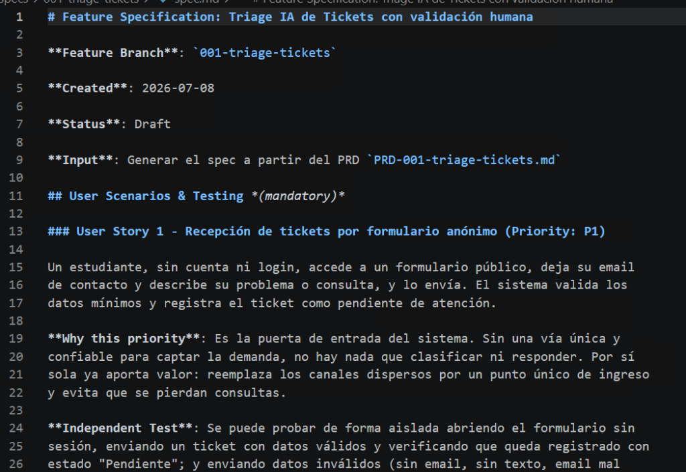

# Ejercicio guiado: Escribir el spec (desde el PRD2)

Llegamos al corazón del módulo. Hasta acá preparamos el terreno; ahora generamos el **spec**, el contrato que va a dirigir toda la construcción. Y acá hay una buena noticia que conecta todo el curso: **no lo escribís a mano.** 🎯

## 🌱 El PRD2 es la semilla del spec

¿Te acordás del PRD que escribiste en M1 y que en M3 terminaste de pulir con tu skill hasta `PRD2.md` —ese documento verificable con tus RF, RNF y criterios de aceptación—? Llegó su momento de brillar. El comando `/speckit-specify` **toma tu PRD2 y genera el spec a partir de él** —le pasás el archivo (por ruta o URL) y el agente lo redacta—. Esto es exactamente lo que te prometí en M1: que el PRD bien hecho te ahorraba trabajo más adelante. Acá lo cobrás, y lo cobrás con la versión más madura que tenés, no con el primer borrador.

```
/speckit-specify Generá el spec a partir del PRD en docs/PRD2.md
```

Y hay algo que pasa «atrás de escena» que vale la pena que sepas, aunque no lo tengas que operar a mano: al correr este comando, Spec Kit crea una **rama nueva de Git** para esta feature (algo como `001-clasificacion-de-tickets`) y su propia carpeta numerada dentro de `specs/`. Ahí es donde va a vivir el `spec.md` que estás por generar, y después el `plan.md` y el `tasks.md` de las próximas lecciones — todos juntos, prolijamente separados de cualquier otra feature que armes más adelante.



## 📋 Qué tiene un spec (y qué no)

El spec que sale es un documento con **historias de usuario**, **criterios de aceptación** y el **fuera de alcance**. Describe el **qué** y el **porqué** con precisión —pero **todavía no el cómo técnico**—. Nada de stack, frameworks ni decisiones de arquitectura: eso llega recién en la fase de plan (y ya sabés que tu Stack está a salvo, copiado en tu guardrail). Mezclar el cómo en el spec es un error clásico; el spec es el contrato de comportamiento, no el diseño.

La diferencia entre un spec útil y uno inútil es la misma de siempre: **precisión vs ambigüedad**. Un spec que dice «el sistema clasifica el ticket correctamente» no sirve —¿qué es correctamente?—. Uno que dice «asigna una categoría de un set cerrado y una prioridad, y para un ticket de cobro duplicado la categoría es facturación» sí. Por eso el spec, como el PRD2, se apoya en criterios verificables — es, de hecho, la misma disciplina de Dado/Cuando/Entonces que ya usaste en M1, ahora aplicada por el agente en vez de por vos a mano.

## 🛠️ Tu turno: generá el spec de tu app

⏱️ **Tiempo estimado:** ~25 min · 📦 **Entregable:** el draft del spec de tu app, generado desde el PRD2.

1. Asegurate de tener tu `PRD2.md` (el que copiaste en la lección anterior) accesible en el repo de M4.
2. Corré **`/speckit-specify`** pasándole el PRD2 (ruta o URL).
3. Leé el spec que generó: ¿captura tus historias de usuario y criterios de aceptación? ¿Se metió a hablar de stack (eso no va todavía)?
4. No te preocupes si quedan dudas o marcadores `[NEEDS CLARIFICATION]` — eso lo resolvemos en la próxima lección.

> ✅ **Lo lograste cuando** tenés un draft de spec generado desde tu PRD2, con historias y criterios de aceptación, y sin decisiones técnicas adentro.

### 🔎 La muestra: el spec de clasificación de TicketTriage

Importante: el spec **se genera on-the-fly**. Le pasás el `PRD2.md` a `/speckit-specify` y el agente redacta un documento **bastante más largo que esto** —varias historias de usuario, requerimientos, escenarios de aceptación, casos borde y criterios de éxito—. Acá te muestro solo **un recorte** de la feature de clasificación, para que veas la forma:

```
# Feature Specification: Triage IA de Tickets con validación humana

**Feature Branch**: `001-triage-tickets`

**Created**: 2026-07-08

**Status**: Draft

**Input**: Generar el spec a partir del PRD `PRD-001-triage-tickets.md`

## User Scenarios & Testing *(mandatory)*

### User Story 1 - Recepción de tickets por formulario anónimo (Priority: P1)

Un estudiante, sin cuenta ni login, accede a un formulario público, deja su email
de contacto y describe su problema o consulta, y lo envía. El sistema valida los
datos mínimos y registra el ticket como pendiente de atención.

**Why this priority**: Es la puerta de entrada del sistema. Sin una vía única y
confiable para captar la demanda, no hay nada que clasificar ni responder. Por sí
sola ya aporta valor: reemplaza los canales dispersos por un punto único de ingreso
y evita que se pierdan consultas.

**Independent Test**: Se puede probar de forma aislada abriendo el formulario sin
sesión, enviando un ticket con datos válidos y verificando que queda registrado con
estado "Pendiente"; y enviando datos inválidos (sin email, sin texto, email mal
formado) para verificar que se rechaza con el error correspondiente.

**Acceptance Scenarios**:

1. **Given** un usuario sin sesión iniciada, **When** accede a la URL del formulario, **Then** puede visualizar y completar el formulario sin que se le pida login.
2. **Given** el formulario, **When** el estudiante intenta enviar sin email o sin texto de consulta, **Then** el envío se rechaza y se muestra el error del campo faltante.
3. **Given** el formulario, **When** el estudiante ingresa "juan@" como email, **Then** el envío se rechaza indicando formato de email inválido.
4. **Given** un ticket enviado con datos válidos, **When** se procesa el envío, **Then** el ticket queda persistido con estado "Pendiente".

---

### User Story 2 - Clasificación y borrador asistidos por IA con respuesta validada (Priority: P2)

Cada ticket recibido es clasificado automáticamente en una categoría fija y se le
genera un borrador de respuesta. Sofía, la operadora, ingresa al backoffice con
usuario y contraseña, ve los tickets con su categoría y estado, confirma o corrige
la categoría, edita el borrador si hace falta, y aprueba el envío. Al aprobar, se
envía la respuesta por correo al email del estudiante y el ticket pasa a
"Respondido", quedando registrada la fecha y hora de envío.

**Why this priority**: Es el núcleo de la propuesta de valor: reduce el tiempo de
Sofía apoyando la respuesta con IA, manteniendo la decisión final siempre humana.
Depende de que exista la recepción de tickets (US1).

**Independent Test**: Con al menos un ticket "Pendiente" cargado, se verifica que
tenga categoría (dentro del set fijo) y un borrador no vacío; que Sofía deba
autenticarse para entrar; que pueda confirmar/corregir categoría y editar el
borrador; y que al aprobar se dispare el correo al email del ticket, el estado pase
a "Respondido" y quede registrada la fecha/hora de envío.

**Acceptance Scenarios**:

1. **Given** un ticket recibido, **When** la IA lo procesa, **Then** queda asignada exactamente una categoría del set {"Problema técnico", "Consulta de contenido", "Administrativo/pagos", "Otro"}.
2. **Given** un ticket recibido, **When** la IA lo procesa, **Then** existe un borrador de respuesta no vacío asociado al ticket.
3. **Given** un usuario sin credenciales válidas, **When** intenta acceder al backoffice, **Then** el sistema le niega el acceso.
4. **Given** Sofía autenticada, **When** abre el backoffice, **Then** ve la lista de tickets con categoría y estado de cada uno.
5. **Given** un ticket con categoría asignada por IA, **When** Sofía confirma la categoría, **Then** el ticket queda marcado como categoría validada sin cambios.
6. **Given** un ticket con categoría "Otro", **When** Sofía la cambia a "Problema técnico", **Then** el ticket queda con categoría "Problema técnico".
7. **Given** un borrador de respuesta, **When** Sofía edita el texto y guarda, **Then** la respuesta almacenada refleja el texto editado.
8. **Given** un ticket con respuesta validada, **When** Sofía lo aprueba, **Then** se envía el correo al email del estudiante, el estado pasa a "Respondido" y queda registrada la fecha y hora de envío.
9. **Given** un ticket aprobado, **When** se envía la respuesta, **Then** el destinatario del correo es exactamente el email cargado en el formulario de ese ticket.

---

### User Story 3 - Agrupación de tickets similares y aprobación en lote (Priority: P3)

Cuando varios estudiantes reportan el mismo problema (por ejemplo, 25 reportes casi
idénticos de una falla de quiz), el sistema los detecta como similares y los agrupa,
generando un único borrador de respuesta para todo el grupo. Sofía revisa el grupo,
ajusta el borrador si hace falta y aprueba en lote: con una sola acción se responde
a todos los tickets del grupo.

**Why this priority**: Es el multiplicador de eficiencia que ataca el caso testigo
(picos de tickets idénticos). Aporta el mayor ahorro de tiempo, pero depende de que
la clasificación, el borrador y la respuesta individual (US2) ya funcionen.

**Independent Test**: Con un conjunto de tickets que describen el mismo problema, se
verifica que queden asignados a un mismo grupo con un único borrador; y que al
ejecutar "aprobar en lote" con el borrador validado, todos los tickets del grupo
pasen a "Respondido" y se envíe el correo a todos los emails con una sola acción.

**Acceptance Scenarios**:

1. **Given** un conjunto de tickets con el mismo problema, **When** la IA los procesa, **Then** quedan asignados a un mismo grupo y ese grupo tiene un único borrador de respuesta.
2. **Given** un grupo de 25 tickets similares con un borrador validado, **When** Sofía ejecuta "aprobar en lote", **Then** los 25 tickets pasan a "Respondido" y se envía el correo a los 25 emails con una sola acción.

---

### Edge Cases

- **Campos faltantes o email inválido**: el envío del formulario se rechaza mostrando el error del campo específico; no se crea el ticket.
- **Email con formato válido pero mal tipeado**: se acepta el ticket (no es detectable); la respuesta puede no llegar. Queda como limitación conocida por tratarse de un formulario anónimo.
- **Acceso no autorizado al backoffice**: un anónimo que intenta ver cualquier vista del backoffice o datos de tickets de otros estudiantes recibe acceso denegado y no se expone ningún dato de tickets ajenos.
- **Pico masivo de tickets** (tipo "falla de quiz"): el sistema debe absorber al menos 100 tickets en 10 minutos sin perder ninguno.
- **Límite de cuota de envío de correo**: ante un lote grande de aprobaciones, si se alcanza la cuota diaria de la cuenta de correo, los envíos pendientes deben encolarse/reintentarse sin perderse.
- **Agrupación errónea**: si el sistema agrupa tickets que no son el mismo problema, Sofía debe poder detectarlo al revisar el grupo antes de aprobar en lote (el borrador de grupo es editable).
- **Clasificación incorrecta o borrador inexacto de la IA**: Sofía puede corregir la categoría y editar el borrador; ningún correo sale sin su aprobación.
- **Información no respaldada por la fuente de verdad**: si el borrador no puede sustentarse en la base de conocimiento, no debe afirmar datos inventados; el caso debe quedar señalado para resolución humana.

## Requirements *(mandatory)*

### Functional Requirements

- **FR-001**: El sistema MUST exponer un formulario público de carga de tickets accesible sin login.
- **FR-002**: El sistema MUST requerir en el formulario el email de contacto del estudiante y el texto de la consulta o reclamo.
- **FR-003**: El sistema MUST validar que el email tenga formato válido antes de aceptar el ticket, y rechazar el envío si falta algún campo obligatorio.
- **FR-004**: El sistema MUST persistir cada ticket recibido con estado inicial "Pendiente".
- **FR-005**: El sistema MUST clasificar automáticamente cada ticket en exactamente una categoría del set fijo {"Problema técnico", "Consulta de contenido", "Administrativo/pagos", "Otro"}.
- **FR-006**: El sistema MUST generar automáticamente un borrador de respuesta no vacío para cada ticket.
- **FR-007**: El borrador de respuesta MUST apoyarse únicamente en la fuente de verdad (base de conocimiento) y NO afirmar información que no esté en ella; ante información ausente o ambigua, el caso MUST derivarse a revisión humana en lugar de inventar contenido.
- **FR-008**: El sistema MUST detectar tickets similares entre sí y agruparlos, generando un único borrador de respuesta por grupo.
- **FR-009**: El sistema MUST requerir usuario y contraseña para acceder al backoffice de la operadora.
- **FR-010**: El sistema MUST negar el acceso al backoffice y a los datos de tickets a cualquier usuario sin credenciales válidas, sin exponer datos de tickets ajenos.
- **FR-011**: El sistema MUST listar en el backoffice los tickets con su categoría asignada y su estado.
- **FR-012**: El sistema MUST permitir a la operadora confirmar la categoría asignada por la IA.
- **FR-013**: El sistema MUST permitir a la operadora modificar la categoría asignada por la IA.
- **FR-014**: El sistema MUST permitir a la operadora editar el texto del borrador de respuesta (individual y de grupo).
- **FR-015**: El sistema MUST permitir a la operadora aprobar un ticket individual.
- **FR-016**: El sistema MUST permitir a la operadora aprobar en lote, con una sola acción, todos los tickets de un grupo de similares.
- **FR-017**: El sistema MUST enviar por correo electrónico la respuesta aprobada al email que el estudiante dejó en el formulario de ese ticket.
- **FR-018**: El sistema MUST cambiar el estado del ticket a "Respondido" luego de enviar el correo.
- **FR-019**: El sistema MUST registrar la fecha y hora de envío de cada respuesta.
- **FR-020**: El sistema MUST mantener el 100% de las respuestas bajo aprobación humana antes del envío: ningún correo sale sin la aprobación de la operadora.
- **FR-021**: Ante un pico de recepción, el sistema MUST encolar/reintentar los envíos de correo pendientes sin perder tickets ni respuestas cuando se alcanza el límite de cuota del proveedor de correo.

### Key Entities *(include if feature involves data)*

- **Ticket**: consulta/reclamo enviado por un estudiante. Atributos clave: email de contacto, texto de la consulta, categoría asignada, estado ("Pendiente" / "Respondido"), borrador de respuesta asociado, grupo al que pertenece (si aplica), fecha/hora de recepción y fecha/hora de envío de la respuesta.
- **Categoría**: valor dentro de un set fijo de cuatro opciones; indica el tipo de ticket y puede estar en estado "asignada por IA" o "validada por la operadora".
- **Grupo de tickets similares**: conjunto de tickets detectados como el mismo problema; tiene un único borrador de respuesta compartido y habilita la aprobación en lote.
- **Borrador de respuesta**: texto propuesto para responder a un ticket o grupo; editable por la operadora; se apoya en la fuente de verdad.
- **Operadora (Sofía)**: único rol humano con credenciales que opera el backoffice, valida clasificación y borradores y aprueba envíos.
- **Fuente de verdad (base de conocimiento)**: contenido de referencia que sustenta los borradores; nada fuera de ella puede afirmarse en una respuesta.

## Success Criteria *(mandatory)*

### Measurable Outcomes

- **SC-001**: El tiempo total que la operadora dedica a resolver tickets se reduce ≥ 30% respecto del baseline manual, apalancado en la respuesta en lote de tickets similares.
- **SC-002**: El tiempo de primera respuesta al estudiante (desde el envío del formulario hasta la recepción del correo aprobado) es < 8 horas hábiles.
- **SC-003**: El 100% de las respuestas enviadas fue aprobado por la operadora antes del envío (ningún envío automático).
- **SC-004**: La precisión de clasificación automática es ≥ 70%, medida como % de tickets cuya categoría asignada por la IA es confirmada por la operadora sin cambios.
- **SC-005**: El formulario público carga en < 3 segundos (p95).
- **SC-006**: La clasificación y el borrador quedan disponibles en el backoffice en < 60 segundos desde la recepción del ticket (p95).
- **SC-007**: El envío del correo al estudiante ocurre en < 30 segundos desde la aprobación (p95).
- **SC-008**: El sistema absorbe al menos 100 tickets recibidos en 10 minutos sin pérdida de tickets.
- **SC-009**: La disponibilidad mensual del formulario público es ≥ 99%.
- **SC-010**: El costo de procesamiento de IA por ticket es < USD 0,05.
- **SC-011**: Una operadora resuelve un grupo de 25 tickets idénticos con una sola acción de aprobación en lote (caso testigo "falla de quiz").

## Assumptions

- El alcance de esta especificación es el del PRD completo (recepción, clasificación, borrador, agrupación, aprobación individual y en lote, y envío de correo). La mención en la guía del proyecto a "CRUD + clasificación + borrador" se interpreta como resumen y no como recorte del alcance del PRD.
- v1 tiene un único rol humano operador (Sofía); no hay múltiples agentes ni gestión de permisos por equipo.
- El set de categorías es fijo (cuatro valores); no hay ABM de categorías en v1.
- El único canal de ingreso es el formulario web; no hay email entrante, WhatsApp, chat ni API pública de carga.
- El sistema envía una respuesta por ticket; no gestiona hilos ni réplicas del estudiante.
- Los estudiantes no tienen cuenta ni login; el formulario es siempre anónimo.
- La seguridad de credenciales del backoffice sigue prácticas estándar de la industria para almacenamiento de contraseñas.
- Existe una cuenta de correo disponible para el envío de las respuestas y una fuente de verdad (base de conocimiento) que sustenta los borradores.
- Para verificar la reducción ≥ 30% (SC-001) se dispone de una medición del baseline de tiempo actual por ticket.

## Dependencies

- Cuenta de correo para el envío de las respuestas a los estudiantes.
- Proveedor de IA para clasificación, detección de similitud y redacción de borradores.
- Fuente de verdad (base de conocimiento) que respalda el contenido de los borradores.
- Medición del baseline de tiempo por ticket para validar el objetivo de reducción de tiempo.
```

Salió directo del PRD2 (mismos criterios que ya habías validado), no habla de FastAPI ni de Claude (eso es el plan), y dejó marcado un `[NEEDS CLARIFICATION]` que resolvemos en la próxima lección.

> 📄 Esto es un recorte. El **spec completo de TicketTriage** vive en el repo de ejemplo, junto al PRD2 y la constitución — agregamos el link en breve. Y recordá: vos no copiás este spec, lo **generás** con `/speckit-specify` desde tu propio PRD2.

Ese marcador es la puerta a la próxima lección: **clarificar y validar el spec**. ➡️
