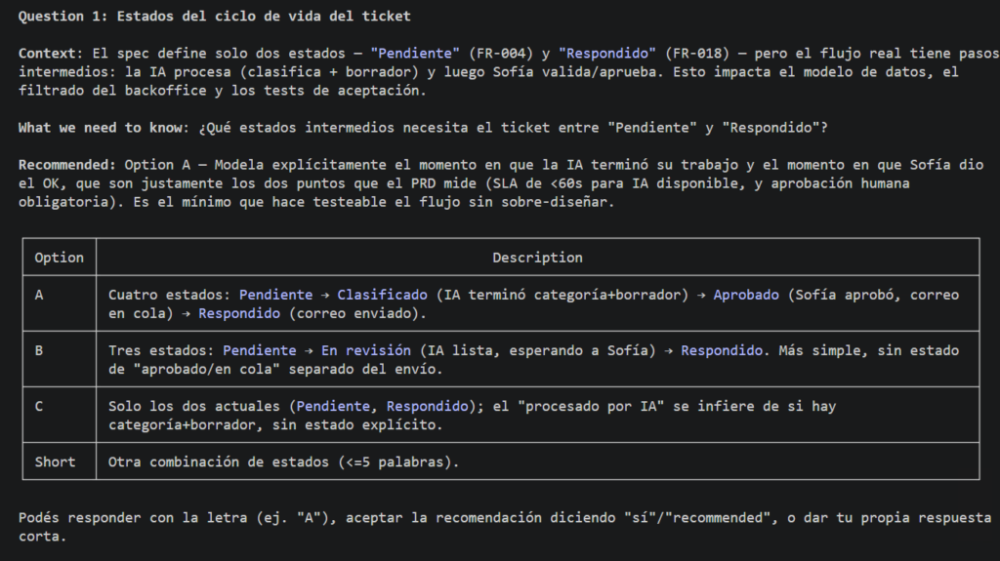
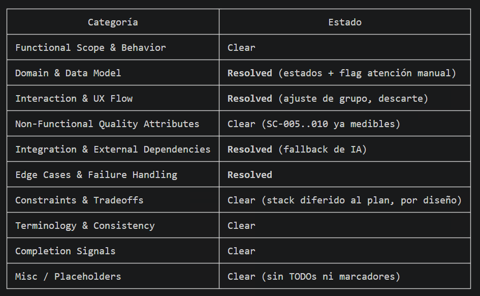
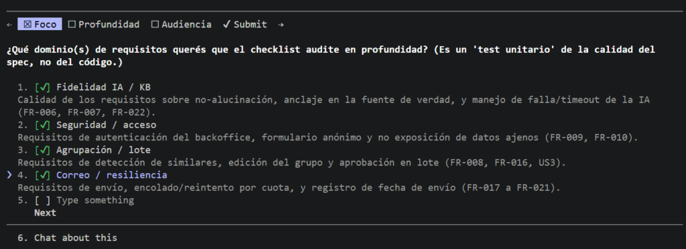

# Ejercicio guiado: Clarificar y validar el spec

Saliste de la lección anterior con un draft de spec que tiene algún `[NEEDS CLARIFICATION]` dando vueltas. Eso no es un problema: es exactamente lo que el SDD viene a sacar a la luz — cada marcador es una decisión que en vibecoding se hubiera tomado sola, en algún rincón del código, sin que nadie la notara. Ahora lo dejamos **completo y sin ambigüedades**, con dos comandos. 🔍

## 🗣️ `/speckit-clarify`: el agente te interroga

El comando `/speckit-clarify` hace algo muy inteligente: en vez de adivinar lo ambiguo, **te pregunta de a una**, como lo haría un buen analista de producto en una reunión de requerimientos. «¿Qué pasa si el ticket viene en otro idioma?», «¿qué prioridad por defecto si la IA no está segura?». Vos respondés, y el agente **escribe tus respuestas dentro del spec**, resolviendo los marcadores uno por uno.



Esto es oro, porque es justo la conversación que en vibecoding nunca tenías a tiempo —las decisiones se tomaban solas, mal, en medio del código, y las descubrías recién cuando algo se comportaba raro—. Acá las tomás vos, explícitas, antes de construir:

- Seguís clarificando hasta que **no queden `[NEEDS CLARIFICATION]` pendientes**.
- Podés pasarle un foco al comando si querés (`/speckit.clarify Enfocate en seguridad y casos borde`), pero por default va a recorrer todo el spec buscando huecos.

Al finalizar el proceso se debe presentar una cobertura completa sin temas a resolver:



## ✅ `/speckit-checklist`: tests para el spec escrito

Una vez clarificado, `/speckit-checklist` valida que el spec esté **completo**. La mejor forma de pensarlo: son como **tests unitarios, pero para el español del spec** —chequean que no falten casos, que los criterios sean verificables, que no haya huecos—.



Genera una lista de ítems (podés pedirle uno enfocado en seguridad, otro en UX, otro en performance, según lo que te preocupe de tu feature) y, si el checklist encuentra algo flojo, lo arreglás antes de avanzar.

> 🔗 Guardate este dato, porque vuelve fuerte en el **Módulo 10 (QA AI-First)**: **los criterios de aceptación de tu spec son la semilla de tus evals.** Cada criterio claro de hoy es un test de QA mañana. Por eso vale la pena dejarlos impecables — el trabajo que hacés acá no se tira después del `implement`, se reusa.

## 🛠️ Tu turno: dejá tu spec sin agujeros

⏱️ **Tiempo estimado:** ~25 min · 📦 **Entregable:** el spec sin `[NEEDS CLARIFICATION]` pendientes y con el checklist pasado.

1. Corré **`/speckit-clarify`** y respondé las preguntas del agente una por una. No te preocupes por indicar la spec, dado que Spec Kit guarda la spec activa en feature.json dentro de .specify.
2. Respondé todas las preguntas.
3. Verificá que ya no queden marcadores `[NEEDS CLARIFICATION]` en el spec.
4. Corré **`/speckit-checklist`** y resolvé lo que marque como incompleto.
5. Releé el spec final: ¿lo podría construir alguien que no estuvo en tu cabeza?

IMPORTANTE: si tu spec no tenia marcadores [NEEDS CLARIFICATION] probá haciendo un PRD un poco menos específico, menos trabajado, para pasar por la experiencia.

> ✅ **Lo lograste cuando** tu spec no tiene marcadores pendientes, pasa el checklist, y cualquiera lo leería y entendería qué construir sin preguntarte nada.

### 🔎 La muestra: clarify en TicketTriage

Para el `[NEEDS CLARIFICATION]` que quedó en la clasificación, el agente preguntó y resolvimos así en el spec:

```
- Si el ticket es ininteligible o está vacío → categoría = "otro", prioridad = "baja",
  y se marca para revisión humana (no se arriesga una clasificación dudosa).
- Si el ticket viene en otro idioma → se clasifica igual (el modelo lo entiende),
  el borrador se redacta en el idioma del ticket.
```

Fijate que cada respuesta es una **decisión concreta** que antes no existía. Eso es el spec haciendo su trabajo: convertir suposiciones en acuerdos que cualquiera puede leer y auditar después.

Con el spec cerrado y validado, pasamos del *qué* al *cómo*: **generar el plan técnico**. ➡️
