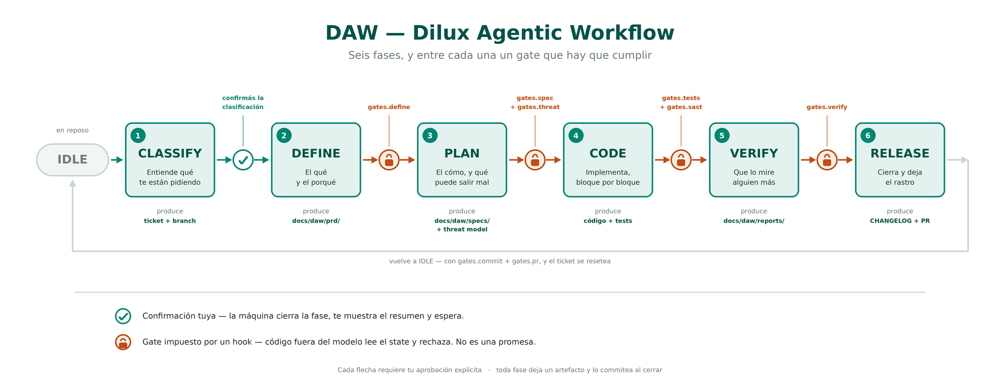

# El pipeline de DAW, fase por fase

Viste el mapa completo. Ahora vamos caja por caja, porque el gráfico te dice **qué** hace cada fase pero no **por qué está ahí** — y las decisiones interesantes están justamente en el porqué. 🛤️

Tenés el mapa acá arriba para ir siguiéndolo mientras leés:



Para cada una vas a ver siempre lo mismo: qué hace, qué deja escrito, qué tiene **prohibido** hacer, y qué hace falta para salir. Esa estructura de cuatro no es casual: en un par de lecciones vas a descubrir que es la plantilla con la que se diseña cualquier fase de cualquier pipeline, y la vas a usar para las tuyas.

Antes de arrancar, dos reglas que gobiernan todas las flechas del gráfico:

> 🚦 **Cada transición requiere tu aprobación explícita.** La máquina cierra la fase, te muestra el resumen de lo que hizo, y **espera**. No avanza sola. Esto es deliberado y volvemos sobre el tema más adelante, porque es una decisión de diseño con la que no todo el mundo está de acuerdo.

> 💾 **Cada fase commitea lo que produjo, al cerrarla.** El PRD se commitea antes que el spec, el spec antes que el código. No hay un commit gigante al final: la historia de git **dice** en qué orden pasaron las cosas en vez de afirmarlo. Y tiene un efecto lateral que se agradece — si abandonás el trabajo a mitad de camino, el pensamiento que ya hiciste **queda en la rama** en vez de evaporarse con la sesión.

—

## 🔍 CLASSIFY — entender antes de hacer

- **Qué hace:** clasifica el **tipo de pedido**, lee el stack de tu `AGENTS.md` y asigna un identificador al trabajo (`FEAT-001`, `FIX-002`).
- **Deja:** el state inicializado + el branch del trabajo creado.
- **Prohibido:** todo. Código, PRD, specs, tests, commits.
- **Para salir:** confirmás la clasificación.

Detenete un segundo en lo primero que hace la máquina cuando le pedís algo: **no salta a codear**. Lo primero que hace es entender qué le pediste y **proponerte qué entendió**, para que vos digas si va o no.

Parece un trámite y es lo contrario: es el antídoto directo al primer modo de falla que vimos en la lección 1. El agente suelto empieza a escribir porque escribir se parece a responder. Acá no puede: la fase tiene prohibido escribir cualquier cosa, y su única salida es que vos confirmes que entendió bien.

Y clasificar sirve para algo más, que a esta altura no es obvio: **no todo pedido tiene que recorrer las seis fases**. Corregir un typo en un mensaje de log no puede costar un PRD; si costara, abandonarías el pipeline en una semana y con razón. Cómo se adapta la máquina al tamaño del pedido lo vemos más adelante, cuando hablemos de tiers — por ahora quedate con que **la clasificación es lo que hace posible esa adaptación**.

—

## 📋 DEFINE — el qué y el porqué

- **Qué hace:** crea el branch del trabajo, escribe o revisa el **PRD**, y controla que el scope no se infle solo mientras se define.
- **Deja:** el PRD en `docs/daw/prd/`, commiteado.
- **Prohibido:** código, specs, y escribir fuera de la carpeta de PRDs.
- **Para salir:** la validación del PRD pasa → `gates.define`.

Fijate el paralelo con todo el curso: es **el mismo artefacto del Módulo 1**. El PRD que aprendiste a escribir a mano, que después puliste vibecodeando y que en el M3 generaste con tu propio skill, ahora es **la entrada de una máquina**. Nada arranca sin un documento que diga qué hay que hacer y por qué — solo que ahora eso no es una buena costumbre tuya, es un requisito del sistema.

El control de scope merece un párrafo aparte porque es de lo más útil y de lo que menos se habla. Cuando definís una feature con un agente, la conversación tiende a **crecer**: aparece «y ya que estamos, ¿no convendría también…?», y de repente lo que era una feature son tres. Esta fase existe para cerrar el alcance **antes** de que ese crecimiento se convierta en código.

—

## 📐 PLAN — el cómo, y qué puede salir mal

- **Qué hace:** diseña la solución técnica, la divide en **bloques de implementación numerados** (cada uno verificable por separado), verifica el impacto contra el codebase real, y corre el **threat model**.
- **Deja:** el spec en `docs/daw/specs/` + el reporte del threat model en `docs/daw/security/`, commiteados.
- **Prohibido:** **escribir código** (éste es el importante), modificar el PRD, y commitear cualquier cosa que no sean los artefactos de esta fase.
- **Para salir:** la validación del spec pasa **y** el threat modeling está hecho → `gates.spec` + `gates.threat`.

Dos cosas de esta fase valen la pena.

La primera es la **verificación de impacto**: antes de presentarte el plan, la máquina chequea contra el codebase real que los archivos que menciona existan, que no haya implementaciones paralelas sin cubrir, que todos los lugares que llaman a una función modificada estén contemplados. Es el paso que evita el clásico plan que se ve impecable y a los diez minutos de implementarlo descubrís que faltaba la mitad.

La segunda es el gate:

> 🔒 **De todos los candados del gráfico, éste es el que más trabaja.** El de `PLAN → CODE` protege la regla de oro del spec-driven: **sin spec aprobado, no hay código**. Y lo hace por dos vías, no una: el hook no te deja **transicionar** a CODE sin `gates.spec` y `gates.threat`, y además no te deja **escribir código fuente** mientras sigas en PLAN. Sin la segunda, la primera se esquivaría sola — bastaría con no molestarse en transicionar. Es la diferencia entre un cartel que dice «por favor no pasar» y una puerta con llave, y le vamos a dedicar una lección entera porque es la idea más importante del módulo.

—

## 💻 CODE — implementar, bloque por bloque

- **Qué hace:** implementa siguiendo el spec, **un bloque a la vez**. Cada bloque cierra con sus propios tests antes de que empiece el siguiente.
- **Deja:** el código + los tests, commiteados.
- **Prohibido:** modificar el PRD, modificar el spec.
- **Para salir:** los tests pasan **y** el análisis estático de seguridad está limpio → `gates.tests` + `gates.sast`.

**Por qué bloque por bloque, y no todo junto que sería más cómodo.** Un bloque chico es **verificable** —sabés si funciona antes de seguir— y **reversible** —si salió mal, descartás poco—. Implementar todo de una anda bien hasta que algo falla, y ahí tenés cuatrocientas líneas nuevas y ninguna pista de dónde está el problema.

Hay un efecto secundario que se agradece: como cada bloque queda registrado en el state, si cortás la sesión a mitad de camino, al volver la máquina sabe que ibas por el bloque 3 de 5. No hay que reconstruir nada de memoria.

Y fijate **cuándo** commitea esta fase: **un commit por bloque, apenas el bloque queda en verde.** No uno solo al final.

El criterio es el mismo de siempre —se commitea cuando el código está en un estado que vale la pena guardar— pero acá ese estado llega **cuatro veces**, no una: cada bloque pasó sus dos revisiones y sus tests antes de que empiece el siguiente. Guardar tres bloques verdes para commitearlos juntos al final significa que, si cortás después del segundo, **se pierden los dos**. Que es exactamente la pérdida que el commit por fase existe para evitar, un nivel más abajo.

> 🧩 **Y ojo con el que hace el commit, que es la parte que no se puede mover.** El subagente que implementa **nunca commitea ni toca el state** — eso lo hace el orquestador, después de revisar lo que volvió. Si un subagente pudiera mover el estado, la máquina se rompería desde adentro: el que hace el trabajo estaría certificando su propio trabajo.

Y notá lo que está prohibido: **no se puede tocar el spec desde acá**. Si mientras implementás descubrís que el spec estaba mal —cosa que pasa— no se parcha sobre la marcha: se vuelve a PLAN, se corrige, y se baja de nuevo. Suena burocrático, pero es lo que impide que el spec y el código se separen silenciosamente hasta que el documento deja de describir la realidad.

—

## 🔎 VERIFY — que lo mire alguien más

- **Qué hace:** verificación cruzada con un agente **que no escribió el código**, contra el PRD y contra el spec: que cada criterio de aceptación tenga un test que pase, que cada tarea del spec esté implementada, que la cobertura llegue, que haya tests de camino infeliz.
- **Deja:** el reporte en `docs/daw/reports/`, commiteado.
- **Prohibido:** escribir código.
- **Para salir:** `gates.verify`.

> ⚠️ **Si la verificación falla, no se corrige acá.** La máquina vuelve a CODE, se arregla allá, y se vuelve a pasar por VERIFY.

Esta regla parece un capricho y es de las mejores decisiones del pipeline. Si el verificador pudiera arreglar lo que encuentra, dejaría de ser un verificador y pasaría a ser un implementador con otro nombre. Y hay algo peor: ese arreglo hecho sobre la marcha, apurado, **no pasaría por los gates de CODE** — no correrían sus tests, no correría el análisis de seguridad. Terminarías con código que entró por la ventana.

La otra mitad de la idea es **quién** verifica. No es el mismo agente que escribió el código: es uno con contexto limpio. El motivo es más profundo de lo que parece y lo desarrollamos en la próxima lección, pero adelanto la conclusión: **nadie se corrige bien a sí mismo**, ni las personas ni los modelos.

Y una tercera cosa, que es la que más se agradece con el tiempo: **el veredicto queda escrito**. Qué reglas se chequearon, cuánta cobertura hubo, qué warnings aparecieron aunque no bloquearan. Si la corrida volvió a CODE y hubo que verificar dos veces, **las dos vueltas quedan en el reporte** — cuántas rondas tardó en pasar es parte de lo que pasó, y es exactamente el dato que alguien busca seis meses después cuando pregunta si esto se revisó de verdad o se aprobó de apuro.

—

## 🚀 RELEASE — cerrar bien

- **Qué hace:** CHANGELOG, pull request (siempre en **draft**), **dónde aterriza la rama**, actualización del ticket si usás un gestor, y el cierre.
- **Deja:** el PR + la trazabilidad completa.
- **Para salir:** `gates.commit` + `gates.pr` → confirmás el cierre y la máquina vuelve a IDLE, lista para el próximo pedido.

Hay un paso acá que parece administrativo y no lo es: **¿dónde aterriza esta rama?** Un ticket que cierra con su trabajo colgado de una rama que nadie va a mergear es trabajo que existe y sobre el que nadie puede construir — y te enterás **un ticket después**, cuando el siguiente sale de una base que no tiene el código del anterior. Así que se pregunta, siempre, y la respuesta queda escrita en el cierre: mergeada ahora, esperando el PR, la siguiente sale de ésta, o la manejás vos.

👉 **Y fijate que no es un gate**, aunque suene a que debería serlo. Un gate solo puede exigir lo que el repo puede ver, y **si alguien mergeó o no depende de personas y sistemas que están afuera**. Es un *paso obligatorio*: se resuelve en voz alta delante tuyo y queda registrado. La distinción entre esas dos cosas —lo que la máquina puede verificar y lo que solo puede obligarte a contestar— es una de las que más te va a servir cuando diseñes el tuyo.

Y hay otro detalle que muestra bien cómo piensa el pipeline. Como cada fase ya commiteó lo suyo, cuando RELEASE llega es normal que **el árbol esté limpio y no haya nada que commitear**. En ese caso el gate `commit` no se satisface fabricando un commit vacío para poder tildarlo: se verifica que **el trabajo esté en la rama**, mirando los commits que ya están ahí. La diferencia es sutil y es toda la diferencia — el gate pide que el trabajo esté registrado, no que haya un commit más.

—

## 🚪 Y si te querés bajar en el medio

Falta una salida que no está en el gráfico y que en la vida real usás todo el tiempo: **abandonar** un trabajo, o **pausarlo** para retomarlo. Se puede desde cualquier fase, y no debés nada — ni commit, ni PR, ni completar los gates que te faltaban.

Con una sola condición: **decir cuál de las dos es, y por qué**. Queda escrito en el historial así:

```
"action": "abandon: la idea no sobrevive a su propio análisis de costos"
```

Bajarse siempre está permitido; bajarse **en silencio** no. Y el motivo es el de siempre: el historial es lo que alguien lee dentro de seis meses para entender qué pasó con este ticket, y *«esto se abandonó, y por qué»* es exactamente la clase de cosa que vale oro y que nunca está escrita en ningún lado.

La única fase de la que **no** te podés bajar es RELEASE. Y es una decisión fina, así que vale la pena entenderla: en RELEASE ya no queda nada por decidir, solo pasos por terminar. Si se pudiera abandonar desde ahí, la palabra «abandono» sería una **llave maestra** — escribís `abandon` en vez de `cerrar`, y saliste sin commit y sin PR. Un solo gate que se puede esquivar con un cambio de etiqueta convierte a todos los demás en sugerencias.

> 🧠 **Para tu diseño:** cuando pongas una salida de emergencia, preguntate qué gate te deja saltear. Si la respuesta es «el único que importaba», no es una salida de emergencia: es un agujero.

—

## 📟 La línea de estado

Cada respuesta de la máquina arranca diciendo dónde está parada:

```
💻 FEATURE · Implementando [3/5] · Bloque 2/4 | FEAT-001: Clasificación de tickets
```

Parece cosmético y no lo es: es **el state hecho visible en cada turno**. Su función concreta es que puedas darte cuenta **en el primer renglón** de que algo se desalineó. Si vos esperabas estar en PLAN y la línea dice CODE, lo ves antes de que se escriban tres archivos, no después.

Es de las cosas más baratas de implementar y más valiosas de tener. Cuando diseñes tu pipeline, ponele una.

## 📦 Lo que queda en el repo al final

```
docs/
├── daw/           todo lo que produjo el pipeline
│   ├── prd/         qué se construyó y por qué
│   ├── specs/       cómo se decidió construirlo (specs, fix-plans, RCAs)
│   ├── security/    threat models y reportes de SAST
│   ├── reports/     qué se verificó y qué se encontró
│   └── discovery/   los conceptos que salieron de ideación
└── adr/           las decisiones de arquitectura, con su razón
```

Del pedido en lenguaje natural hasta el pull request, **todo el camino queda escrito**. Es el subproducto que nadie espera al principio y el que más se agradece seis meses después, cuando alguien —probablemente vos— pregunta «¿por qué esto se hizo así?» y la respuesta existe en vez de estar perdida en una conversación que ya nadie tiene.

Mirá dónde está la línea: **todo lo del pipeline vive junto abajo de `docs/daw/`**, separado de la documentación que escribís vos. Sacás DAW del proyecto y borrás esa carpeta sin llevarte puesto nada tuyo. La excepción son los **ADR**, que quedan afuera a propósito: una decisión de arquitectura le pertenece a tu proyecto, no a la herramienta que la anotó.

## ⚖️ Comparado con lo que hacías en el Módulo 4

|  | Spec Kit (M4) | DAW |
| --- | --- | --- |
| **Quién dispara cada paso** | Vos, comando por comando | La máquina, según la fase |
| **Si te salteás un paso** | No pasa nada | El hook lo bloquea |
| **Quién recuerda dónde ibas** | Vos | El state, en disco |
| **Qué queda escrito** | El spec | PRD, spec, threat model, reporte de verificación, ADRs, historial |
| **Cuándo se commitea** | Cuando te acordás | Al cerrar cada fase |
| **Qué se verifica al cerrar** | Lo que vos mires | Tests, SAST, y un verificador que no escribió el código |
| **Seguridad** | Si te acordás | Dos gates obligatorios |

Que quede claro: **Spec Kit no estaba mal**. Te enseñó el método, y el método es el mismo. Lo que cambia es quién lo ejecuta.

Suficiente teoría. **Es hora de instalarlo donde va y correrlo con tu proyecto.** ➡️
