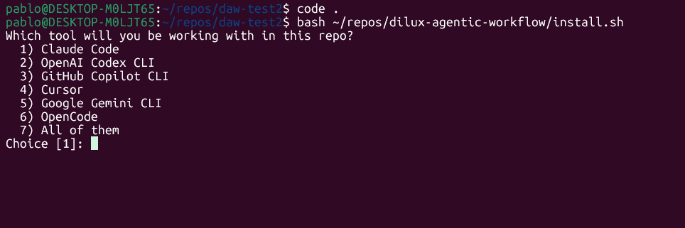
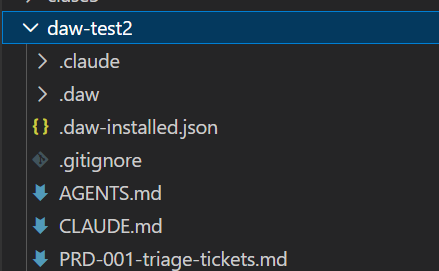

# Ejercicio guiado: Creá el repo de M5 e instalá DAW

Llegó la lección con las manos en la masa, y es de las importantes: acá nace **la vuelta de tu app construida con un pipeline agéntico**. 🛠️

Como en cada módulo, es **una vuelta nueva sobre el mismo proyecto, en su propio repo**. No reutilizamos el de M4: ahí dirigías desde un spec disparando cada comando a mano; acá el flujo se orquesta solo. Y como siempre, **lo que se reconstruye de cero es el código** — esa es la variable que este módulo compara.

Pero atención, porque acá hay una diferencia importante con lo que hiciste en M4.

## 🧳 Qué viaja a este repo (y qué no)

En M4, cuando armaste el repo de Spec Kit, te llevaste tres cosas: el PRD, el guardrail y tus skills. Tenía todo el sentido: **Spec Kit no trae herramientas propias**, así que tus skills eran los únicos que ibas a tener.

**Acá es distinto, y conviene entender por qué.** DAW **trae su propio instrumental completo**: dieciséis skills, cinco subagents (tres auditores, un implementador y un verificador) y los hooks de enforcement. `daw-create-spec`, `daw-validate-prd`, `daw-test`, `daw-security-sast`, `daw-commit`, `daw-create-pr` — están todos, escritos para encajar en las fases del pipeline y en sus gates. Fijate el prefijo `daw-` en todos: es a propósito, y es lo que hace que **ninguno choque con los tuyos**.

Entonces:

|  | ¿Viaja a este repo? | Por qué |
| --- | --- | --- |
| **El PRD** | ✅ **Sí** | Es conocimiento de **producto**, y es tuyo. Ninguna herramienta te lo da. |
| **Los skills** | ❌ **No** | Los trae DAW, ya integrados al flujo. Los tuyos harían de duplicado. |
| **Los hooks y subagents** | ❌ **No** | Nunca los escribiste; nacen acá, con DAW. |
| **El código** | ❌ **No** | Se reconstruye. Es lo que el módulo compara. |
| **El guardrail** | ⚠️ **A medias** | Y esto merece su propia explicación. |

> 🧠 **La regla:** a este repo viaja **el conocimiento de tu producto**, no tus herramientas. Las herramientas te las da el pipeline. Si copiás tus skills del M3 vas a terminar con dos `create-prd` peleándose por el mismo nombre, y ninguna ventaja a cambio.

Y no perdés nada: tus skills siguen existiendo en el repo del M3, y nada te impide sumar alguno acá más adelante si te hace falta — la única condición es que **no choque de nombre** con uno de DAW. Pero eso sería una decisión de diseño puntual, no un copy-paste de arranque.

## 📄 El guardrail: por qué se parte en dos

Tu `AGENTS.md` / `CLAUDE.md` del Módulo 2 mezcla dos clases de cosas, y hasta ahora eso estaba perfecto:

- **Cosas del proyecto** — el stack, las convenciones de arquitectura, el glosario del dominio, qué no tocar. **Eso sigue haciendo falta.**
- **Cosas del proceso** — cuándo escribir tests, cuándo commitear, en qué orden trabajar. **Eso ahora lo pone DAW**, y con muchísimo más detalle.

Si copiás el guardrail viejo entero, esas reglas de proceso van a **competir** con las del pipeline. No es catastrófico, pero es exactamente el tipo de ruido que hace que un agente cumpla las reglas a medias — el problema que venís arrastrando desde el Módulo 2.

Por eso DAW no te pide que copies el guardrail: **te deja una plantilla** de `AGENTS.md` con placeholders, y vos la completás. Tiene las secciones que el pipeline realmente consume:

- **Stack** — importa más de lo que parece. DAW detecta el stack escaneando los archivos de configuración… pero **tu repo arranca vacío y no hay nada que escanear**. Esta sección es lo que le dice en qué construir.
- **Convenciones de arquitectura** — **DAW valida el código contra esta sección** en la fase CODE. Si la dejás vacía, esa validación no tiene contra qué comparar y deja de servir.
- **Convenciones de código**, **qué NO hacer** y **glosario del dominio**.

Lo que ponés ahí lo sacás de tu guardrail viejo — abrilo al lado y copiá lo que corresponda. La diferencia es que **elegís qué llevar** en vez de arrastrar todo.

Y hay un detalle de diseño que vale la pena mirar: el `AGENTS.md` queda **separado** del `CLAUDE.md`, que solo lo importa. ¿Por qué? Porque `AGENTS.md` describe **tu proyecto** y es agnóstico de herramienta: cuando en el Módulo 6 portes esto a OpenCode, ese archivo **se reusa tal cual**. Es la misma separación que viste entre `.daw/` y `.claude/`, ahora aplicada a tu contexto.

## 🛠️ Tu turno

⏱️ **Tiempo estimado:** ~40 min · 📦 **Entregable:** el repo de M5 con DAW instalado, tu `AGENTS.md` completo y una feature corrida por el pipeline.

**1. Creá el repo de M5.** Nuevo, en GitHub, con un nombre que deje claro que es la misma app con otro método (`tu-app-daw`). Cloná y entrá.

**2. Llevá el PRD** — lo único que viaja:

```
mkdir -p docs/daw/prd
cp ../tu-repo-m3/PRD2.md docs/daw/prd/
```

👉 Va en **`docs/daw/prd/`**, no en la raíz: ahí es donde la fase DEFINE busca los PRDs existentes. Si lo dejás suelto, el pipeline no lo va a ver y te va a querer escribir uno nuevo desde cero. Y fijate el `docs/daw/` del medio: **todo lo que produce o consume el pipeline vive abajo de ahí**, separado de la documentación que escribas vos.

**3. Instalá DAW:**

```
git clone https://github.com/soydiloreto/dilux-agentic-workflow.git ~/dilux-agentic-workflow

bash ~/dilux-agentic-workflow/install.sh . --target claude
```

El `--target claude` es la herramienta con la que vas a trabajar en este módulo. **Si lo omitís, te pregunta:**



Y si volvés a correrlo más adelante sobre un repo que ya tiene DAW, cambia de tono: te dice **para qué herramientas está instalado** y te ofrece actualizarlo o sumar otra. **Instalar y actualizar son el mismo comando** — no hay un `update` aparte que puedas olvidarte de correr. (Y sí: podrías pasarle `claude,opencode,copilot` de una y tener las tres cableadas — pero en M6 y M7 vas a instalar cada una en su propio repo, que es donde se ve el punto.)

Te va a decir que creó un `AGENTS.md` desde la plantilla. Ése es tu próximo paso.

**4. Completá el `AGENTS.md`.** Abrilo, y al lado abrí tu guardrail del M3. Completá los `[...]`:

- **Stack** — copialo del guardrail viejo. Sin esto, el pipeline no sabe en qué construir.
- **Convenciones de arquitectura** — la sección que `daw-validate-arch` va a usar. Aunque pongas tres líneas, ponelas.
- **Qué NO hacer** y **glosario** — traé lo que tenías, si tenías.

Y borrá de la plantilla lo que no aplique. Un `AGENTS.md` con placeholders sin completar es peor que uno corto: le da al agente instrucciones que no significan nada.

**4b. Mirá el `.gitignore`** — el instalador le agregó un bloque:

```
# BEGIN DAW — pipeline runtime, NOT committed (managed by DAW)
#   .daw-state.json  = which phase you are in; yours, not the repo's
#   .daw-paused/     = paused tickets
#   .daw-sessions/   = live session markers
.daw-state.json
.daw-paused/
.daw-sessions/
# END DAW
```

Vale un minuto entender **por qué esos tres van afuera del repo**, porque es una distinción que te va a servir siempre:

- **`.daw/` y `.claude/` SÍ se commitean.** Son el método y el cableado: parte del proyecto, y querés que estén versionados y que un compañero los reciba al clonar.
- **`.daw-state.json` NO.** Es *en qué fase estás vos, ahora*. Es estado de **tu máquina en este momento**, no del proyecto. Si lo commitearas, cada `git pull` te sobrescribiría la fase en la que estabas trabajando — y peor, tendrías conflictos de merge sobre un archivo que la máquina reescribe sola en cada transición.
- **`.daw-paused/` y `.daw-sessions/`** por lo mismo: tus tickets pausados y las marcas de tus sesiones abiertas.

> 🧠 **La regla, que aplica a cualquier herramienta:** el **método** se versiona, el **runtime** no. Si un archivo lo reescribe una máquina varias veces por sesión y describe *tu* momento, va al `.gitignore`.

Si tu repo ya tenía un `.gitignore`, el instalador **no lo pisa**: le agrega el bloque al final. Y si volvés a correrlo, detecta que ya está y no lo duplica.

**5. Verificá que quedó bien.** El árbol tiene que verse así:



```
tu-app-daw/
├── .daw/                el método (orquestador, reglas, grafo, scripts)
├── .claude/             el cableado (settings, agents, skills, hooks)
├── docs/daw/prd/PRD2.md tu PRD
├── AGENTS.md            el contexto de TU proyecto — completado
└── CLAUDE.md            importa AGENTS.md + el orquestador
```

Abrí el `CLAUDE.md`: tiene que tener el bloque `BEGIN DAW … END DAW` con los dos imports.

**6. Comprobá que la máquina está viva.** Abrí el agente parado en el repo y escribile algo simple, sin pedirle nada de código todavía:

```
/daw-status
```

Te tiene que contestar con el estado del pipeline — algo del estilo *«pipeline en IDLE, listo»*. Si te responde eso, **DAW está corriendo**. Si no reconoce el comando, revisá que el bloque `BEGIN DAW` esté en el `CLAUDE.md` y reabrí la sesión.

> ✅ **Lo lograste cuando** tenés el repo con `.daw/`, `.claude/`, tu `AGENTS.md` completado, tu PRD en `docs/daw/prd/`, el `CLAUDE.md` con los dos imports, y `/daw-status` te responde.

## 🧭 Un consejo antes de seguir

Hacé un commit ahora, con todo el andamiaje puesto y **antes de escribir una línea de app**:

```
git add -A && git commit -m "chore: instalar DAW y configurar el contexto del proyecto"
```

Te va a servir de punto cero. Si más adelante querés volver a un pipeline sin modificar —o comparar qué cambiaste— tenés a dónde volver.

En la próxima lección le pedimos la primera feature y lo vemos trabajar. ➡️
