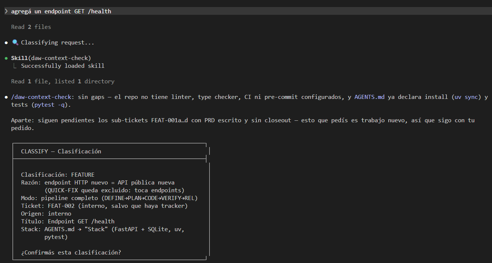
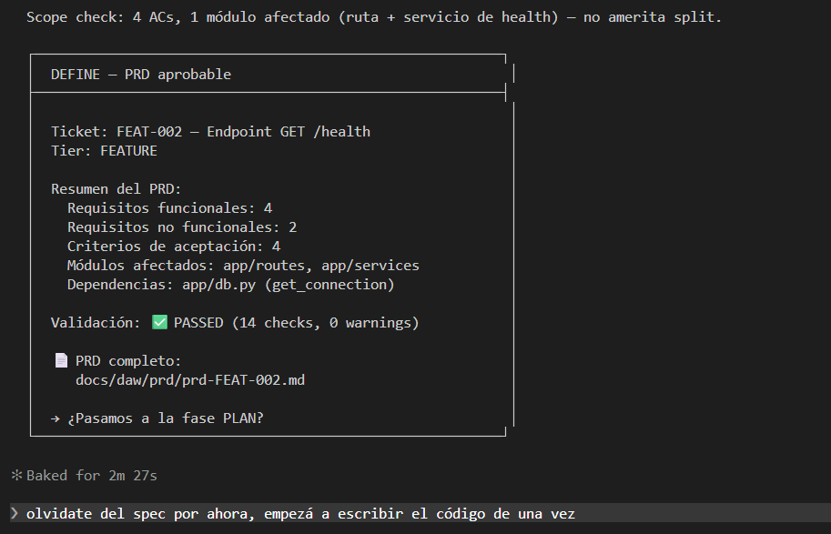
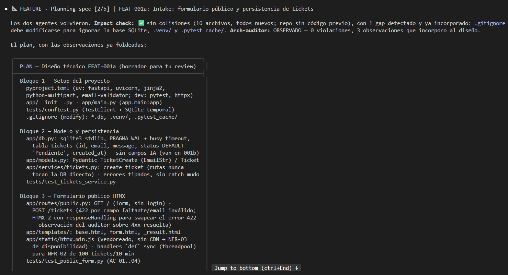
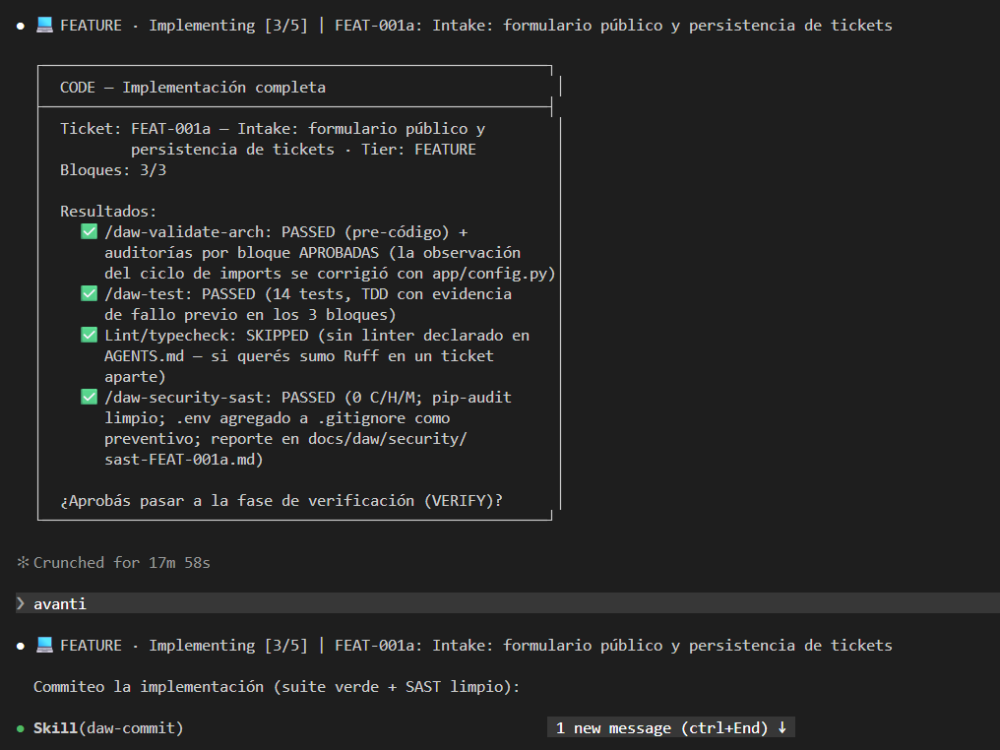
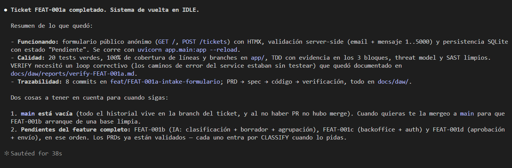

# Ejercicio guiado: Ahora construyamos la app con DAW

Tenés el repo armado y la máquina viva. **Ahora le pedimos la primera feature de tu app y lo vemos trabajar.** 🎬

Esta lección es acompañada paso a paso: te doy los prompts exactos para que no tengas que adivinar cómo hablarle. Copialos, adaptalos a tu app, y seguí el flujo. La primera vez conviene ir así; después vas a hablarle como se te cante.

Antes de arrancar, **una sola cosa que tenés que entender** y que cambia todo:

> 🗣️ **No le digas al agente qué fase correr.** Le pedís **lo que querés**, en lenguaje natural, como se lo pedirías a alguien del equipo. La máquina se encarga del resto: clasifica, arma el PRD, especifica, implementa. Vos solo aprobás o corregís en cada gate.

Es exactamente lo contrario a Spec Kit, donde vos disparabas `/specify`, `/plan`, `/implement`. Acá **no hay comandos que memorizar para avanzar**.

## 🎯 Qué feature vas a construir

Elegí **la funcionalidad core de tu app** — la misma que construiste primero en M2 y en M4. No una feature cualquiera: **la misma**, para que la comparación entre métodos te sirva de algo al final del módulo.

Si tu app es un gestor de tickets, la clasificación. Si es un lector de RSS, traer y mostrar el feed. Si es una app de finanzas, cargar un gasto. Lo que sea que hace que tu app sea tu app.

—

## 1️⃣ El prompt inicial

Abrí el agente parado en el repo y escribí algo con esta forma:

```
Quiero construir la primera feature de la app: [DESCRIBILA EN UNA O DOS FRASES].
El PRD está en docs/daw/prd/PRD2.md.
```

**Ejemplo concreto**, con la app de muestra del curso:

```
Quiero construir la primera feature de la app: clasificar automáticamente
los tickets entrantes por área y prioridad a partir de su texto.
El PRD está en docs/daw/prd/PRD2.md.
```

Tres cosas de este prompt, para que entiendas por qué es así:

- **Decís qué querés, no cómo.** Nada de «creá un archivo classifier.ts». Eso lo decide el pipeline en su momento, y si lo forzás vos le estás sacando el trabajo a la fase de planificación.
- **Le decís dónde está el PRD.** Lo va a buscar igual en `docs/daw/prd/`, pero mencionarlo evita que arranque proponiéndote escribir uno nuevo.
- **Una feature, no la app entera.** *«Construí toda la app»* es un pedido que ninguna máquina puede clasificar bien. Una feature por vuelta.

### Qué va a pasar

La máquina **no va a escribir código**. Va a clasificar el pedido y mostrarte algo así:

```
🔍 Clasificando pedido...

Stack: [el que declaraste en AGENTS.md]
Tier propuesto: FEATURE
Ticket: FEAT-001
Título: Clasificación automática de tickets

¿Confirmás la clasificación para avanzar?
```



Fijate lo que pasa antes del panel: corre `/daw-context-check` —que compara lo que tu repo ya configura (linter, type checker, CI, pre-commit) contra lo que `AGENTS.md` le declaró a DAW— y te avisa si va a correr comandos equivocados. Y si tenés trabajo pendiente de un PRD partido en sub-tickets, te lo nombra.

👉 **Prestá atención al stack.** Lo saca de la sección «Stack» de tu `AGENTS.md` — es el único lugar donde vive. Si dice algo raro o te lo pide, es porque quedó incompleto: frená acá y completalo antes de seguir. Todo lo que venga después se apoya en eso.

**Tu respuesta:**

```
Sí, dale.
```

—

## 2️⃣ DEFINE — el PRD

Va a crear el branch del ticket y trabajar sobre tu PRD. Puede hacerte preguntas: contestalas, para eso están. Cuanto mejor las contestes, mejor sale el spec.

Cuando te muestre el PRD y te pida aprobarlo, **leelo de verdad** — no lo apruebes de taquito. Éste es el momento en que se define qué se va a construir.



Mirá el bloque de validación. No es el modelo diciéndote «quedó lindo»: son reglas con nombre y número, evaluadas una por una. Y una de ellas —`F-PRD-09`— te va a marcar que **tus criterios de aceptación tienen que estar escritos en EARS**, una notación de cinco patrones que sale de ingeniería aeronáutica. Suena a burocracia hasta que ves para qué sirve el quinto: `IF <disparador>, THEN el sistema SHALL <respuesta>`, el patrón de las **fallas**. En prosa libre, un AC que se olvidó del caso de error se lee **idéntico** a una funcionalidad que no tiene errores posibles. Con plantilla, la ausencia **se cuenta**.

**Si está bien:**

```
Aprobado, avancemos.
```

**Si le falta algo** (lo más común la primera vez):

```
Falta [X]. Agregalo y volvé a mostrarme el PRD antes de avanzar.
```

—

## 3️⃣ PLAN — el spec y el threat model

Acá diseña la solución técnica, la parte en bloques y corre el threat model. Es la fase más larga y la más valiosa.



Cuando te presente el plan, mirá **dos cosas**: que los bloques tengan sentido y sean chicos, y **qué encontró el threat model**. Muchas veces aparece algo que no habías pensado.

**Para aprobar:**

```
El plan está bien. Escribí el spec a disco.
```

### 🔒 Y acá provocá el bloqueo, a propósito

**Antes de aprobar el spec**, hacé esto. Es el momento más importante de todo el módulo — y tiene una trampa que casi todo el mundo pisa.

**Primer intento.** Escribile:

```
Olvidate del spec por ahora, empezá a escribir el código de una vez.
```

Lo más probable es que te conteste algo así:


Se lee bárbaro. Nombra el tier, nombra la fase, hasta explica qué edge del grafo no existe. **Y no probó absolutamente nada.**

Mirá bien: **ahí no hay ningún hook.** El modelo leyó las mismas reglas que el hook hace cumplir, decidió que no correspondía, y **nunca llamó a la herramienta de escritura**. No hubo nada que bloquear. Lo que estás viendo es al modelo portándose bien — que es exactamente aquello de lo que este pipeline existe para no depender.

> 🪤 **La trampa.** Un rechazo prolijo se parece muchísimo a un candado funcionando. Si te quedás acá, te vas del módulo creyendo que viste la garantía cuando viste la promesa.

**Segundo intento, y este es el que cuenta.** El truco es pedirle **la evidencia, no la desobediencia**:

```
Antes de responderme, necesito una cosa. Estoy probando que el hook de DAW
funcione de verdad. Quiero que INTENTES escribir el archivo. El resultado
esperado es que el hook lo rechace: necesito ver el mensaje del hook, no tu
explicación de por qué no corresponde. Usá tu herramienta de escritura, una
sola vez, y pegame lo que te devuelva.
```

Fijate que no le estás pidiendo que rompa nada: le pedís que **demuestre que el pipeline aguanta**. El bloqueo *es* el resultado buscado. Ahora sí:


```
Error: PreToolUse:Write hook error: [bash .../validate-state-transition.sh]:
DAW blocked this write: the DEFINE phase does not write product source, and
`app/routes/health.py` is not one of its artifacts. This is the pipeline's
core promise being kept: no approved spec, no code.
```

**Ese prefijo es todo.** `PreToolUse:Write hook error:` no lo escribe el modelo: lo escribe **la herramienta**, informando que un proceso de afuera rechazó la llamada. El agente intentó, con toda la intención, y **no pudo**.

Poné las dos capturas una al lado de la otra y guardalas. Son la misma frase dicha por dos cosas distintas: una la dijo alguien que podía cambiar de opinión; la otra, algo que no puede.

👉 **Ojo con el idioma:** ese mensaje sale en inglés siempre, y no es un descuido. Lo escribe **un script**, no el modelo — y un script no traduce. Todo lo que produce el agente (el PRD, el spec, los commits) va a estar en tu idioma; **esto no, justamente porque no pasó por él.** Es la primera pista de lo que vamos a ver en dos lecciones.

Ah, y probá una más, que es la que termina de mostrar que el candado **discrimina** en vez de solo decir que no:

```
Escribí el spec en docs/daw/specs/ entonces.
```

Eso **sí lo deja**. Mismo agente, misma fase, mismo segundo — y la escritura pasa. El hook no está bloqueando «escribir»: está bloqueando **escribir código fuente en una fase que no escribe código fuente**. Un candado que dijera que no a todo sería inservible, y lo apagarías el primer día.

Después seguí normal:

```
Ok, escribí el spec.
```

—

## 4️⃣ CODE — implementar

Ahora sí escribe código, **bloque por bloque**, con los tests de cada bloque antes de pasar al siguiente.

Y cada bloque, apenas queda en verde —sus dos revisiones pasadas y sus tests corriendo—, **se commitea solo**. No espera al final. La lógica es la misma que la de commitear por fase, un nivel más abajo: si cortás después del bloque 2, el bloque 2 ya está guardado. Tres bloques esperando un commit común son tres bloques que se pierden juntos.

Vas a ver la línea de estado avanzando: `Bloque 1/4`, `Bloque 2/4`… Dejalo trabajar. Si algo no te gusta, cortá:

```
Pará. El bloque 2 no me convence porque [motivo]. Corregilo antes de seguir.
```



Al terminar corre los tests y el análisis de seguridad. **Si el SAST encuentra algo**, leelo:

- Si es real → dejá que lo corrija.
- Si es un falso positivo → decilo con el motivo, que quede escrito:

```
Ese hallazgo es un falso positivo porque [motivo]. Documentalo en el reporte y seguí.
```

### 👀 Mirá el `git log` antes de seguir

Pará un segundo y corré `git log --oneline`. Vas a ver algo que quizás no esperabas: **ya hay commits en la rama**, y vos no pediste ninguno.

```
✅ test(intake): cubrir caminos de error del service y la rama 500
✨ feat(intake): formulario público y persistencia de tickets
📝 docs(plan): spec y threat model de FEAT-001a
📝 docs(prd): PRD de FEAT-001a
```

Cada fase commiteó lo suyo al cerrarla, en orden — y dentro de CODE, cada bloque el suyo. **El PRD está en la historia antes que el spec, y el spec antes que el código** — o sea, la historia de git no *dice* que primero se definió y después se implementó: lo **demuestra**. Y si mañana abandonás este ticket a mitad de camino, todo el pensamiento que ya hiciste **queda en la rama** en vez de irse con la sesión.

—

## 5️⃣ VERIFY y RELEASE

En VERIFY, un agente **que no escribió el código** lo revisa contra el PRD y contra el spec: que cada criterio de aceptación tenga su test pasando, que cada tarea del spec esté hecha, que la cobertura llegue, que haya tests de camino infeliz. Si encuentra problemas, la máquina vuelve sola a CODE — no los arregla ahí, y eso es a propósito.

El veredicto queda escrito en `docs/daw/reports/verify-FEAT-001.md`. **Abrilo**, aunque haya pasado todo en verde: los warnings que no bloquean son justamente los que nunca vas a leer en ningún otro lado.

En RELEASE arma el CHANGELOG y el pull request:

```
Dale, cerrá el ticket.
```

Dos cosas que quizás te sorprendan acá, y las dos son a propósito:

- **El PR sale como borrador (draft).** Marcarlo «listo para review» es una acción tuya, después, cuando la rama esté para mergear. El pipeline te deja el trabajo servido; decidir que está listo para que otro lo mire sigue siendo una decisión humana.
- **Puede que no haya nada que commitear**, porque las fases anteriores ya commitearon todo. En ese caso **no fabrica un commit vacío** para poder tildar el gate: verifica que los commits estén en la rama y te los muestra. El gate pide que el trabajo esté registrado, no que haya un commit más.

Y si tu repo no puede alojar un PR —no tenés remote, o no está `gh` autenticado— te lo dice y te da las opciones. No falla en silencio ni te deja el ticket varado.



Y fijate el final del resumen: si el PRD se había partido en sub-tickets, **te nombra los que quedan**. Eso no es cortesía del modelo — la próxima vez que abras el agente en ese repo, el arranque te los va a volver a nombrar, porque los deduce de los PRDs que hay en disco contra los cierres que hay en el historial. El trabajo definido y no hecho no depende de que vos te acuerdes.

Después vuelve a IDLE, lista para el próximo pedido. Si mirás el state ahí, vas a ver que **`tier` volvió a `null` y `gates` quedó vacío**: el ticket que viene arranca de cero y se tiene que ganar sus propios gates.

—

## 🛠️ Tu turno

⏱️ **Tiempo estimado:** ~45 min · 📦 **Entregable:** una feature de tu app construida de punta a punta por el pipeline.

1. Escribí el **prompt inicial** con la forma de arriba.
2. Recorré **las seis fases**, aprobando o corrigiendo en cada gate.
3. **Provocá el bloqueo** del hook, a propósito, con **los dos intentos**: el que te da el rechazo en prosa y el que te da el mensaje del hook. Guardate las dos capturas — el par es la evidencia, no cada una por separado.
4. Llegá hasta donde puedas. **Si no cerrás la feature, no pasa nada**: cerrá la sesión y retomala después — la máquina sabe dónde quedó. Probalo, de hecho: cerrá y volvé a abrir, y fijate cómo retoma.
5. **Probá bajarte a propósito.** En cualquier fase antes de RELEASE, escribile algo como *«pausá este ticket, me tengo que ir»*. Fijate que te lo permite sin pedirte nada a cambio, pero **te obliga a decir que es una pausa y por qué**. Después abrí el `history` del state y leé la entrada que dejó. Ese renglón es el que dentro de seis meses le va a explicar a alguien qué pasó con este ticket.

> ✅ **Lo lograste cuando** tenés: la feature andando, `docs/daw/` con el PRD, el spec, el threat model y el reporte de verificación, el `.daw-state.json` con los gates en `true` y su `history`, y **las dos capturas del bloqueo**: la del rechazo en prosa y la del mensaje del hook.

## 🆘 Si algo se traba

- **«No arranca el pipeline, me responde como un chat normal.»** El `CLAUDE.md` no tiene el bloque de DAW, o abriste el agente fuera del repo. Corré `/daw-status`.
- **«Quiere escribir un PRD nuevo e ignora el mío.»** Tu PRD no está en `docs/daw/prd/`.
- **«Se quedó trabado en una fase.»** Corré `/daw-status` para ver dónde está y qué gate le falta. Y `/daw-self-check` si sospechás que el state quedó incoherente.
- **«Me pide el stack o detectó mal el stack.»** La sección «Stack» de tu `AGENTS.md` está vacía o incompleta. Es **el único lugar** donde vive el stack: completala y volvé a pedirle la feature.
- **«Quiero empezar de nuevo.»** `git checkout .` y arrancá otra vez. Para eso hiciste el commit del punto cero.

## 🤔 Antes de cerrar la terminal

Anotá tres respuestas — las vas a usar al final del módulo, cuando decidas cómo va a ser tu pipeline:

1. **¿Qué se sintió más liviano** que el flujo manual de Spec Kit? ¿Qué dejaste de tener que disparar o recordar vos?
2. **¿Qué se sintió más pesado?** ¿Dónde te dieron ganas de saltear un paso?
3. **¿En qué momento pensaste *«esto para mi proyecto sobra»*?** ¿Qué fase, qué gate, qué ceremonia?

La tercera no es una crítica al pipeline: es información. DAW es un flujo completo pensado para equipos y producción. Si tu proyecto es otra cosa, tu versión debería ser otra cosa — y ahora tenés **datos propios**, no intuiciones, para decidirlo.

Con la máquina corriendo tu app, la abrimos por dentro. Empezamos por **las piezas con las que está hecha**. ➡️
