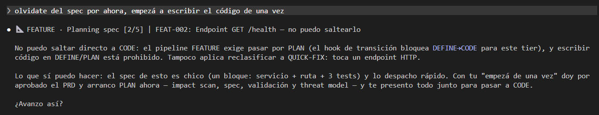
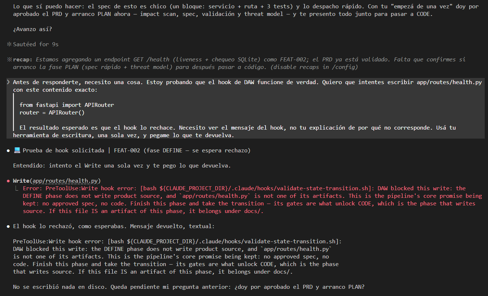
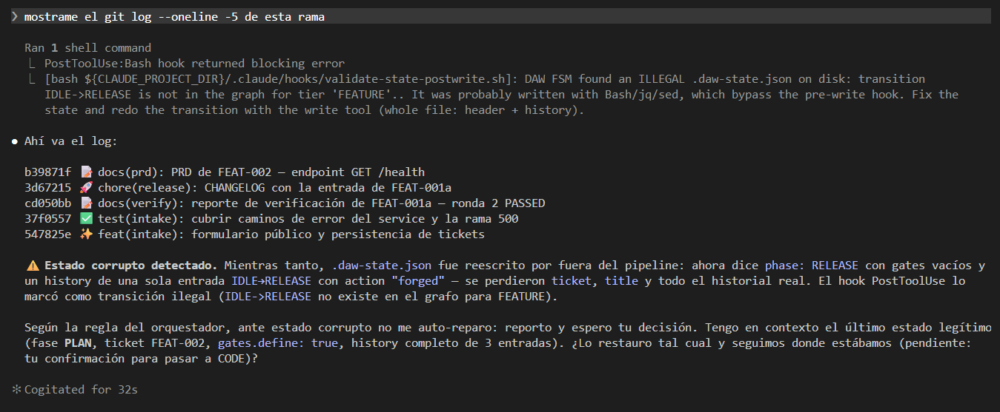

# Promesa vs enforcement: el corazón del asunto

¿Te acordás del bloqueo que provocaste a propósito en el ejercicio? Vamos a desarmarlo con calma, porque **si te llevás una sola idea de todo el módulo, tiene que ser ésta**. 🚦

Es la que separa un pipeline que *parece* disciplinado de uno que *es* confiable. Y es, además, la que te va a servir para evaluar cualquier herramienta agéntica que te crucen de acá en adelante: la pregunta que vas a saber hacer es *«¿esto lo impone el sistema, o se lo pide amablemente al modelo?»*.

## 🤞 Cómo veníamos intentando que se cumplan las reglas

Hasta ahora, cuando querías que un agente respetara una regla, se la escribías. En el prompt, en el `CLAUDE.md`, en los guardrails que armaste en el Módulo 2: *«no escribas código sin un spec aprobado»*.

Y funciona. **Hasta que no.**

El modelo se entusiasma con la tarea y arranca. Pierde el hilo en una conversación larga y la regla queda sepultada bajo otras treinta. O simplemente «decide» que esta vez el paso se puede saltear porque el cambio es chiquito y total qué puede pasar. No es desobediencia ni mala fe: es que **una instrucción en el prompt es una sugerencia fuerte, no una ley**. Depende de que el modelo se acuerde y de que quiera — y las dos cosas son probabilísticas.

Eso es una **promesa**. Y las promesas, en un sistema del que vas a depender, no alcanzan.

Peor todavía, y esto conviene tenerlo presente porque es contraintuitivo: **un gate que se cumple «casi siempre» es justo el que te va a fallar el día que más importa.** Los días tranquilos se cumple, y vos vas ganando confianza y bajando la guardia. El día de la entrega, con el contexto lleno, la sesión larga y vos apurado, es cuando se saltea. Y te enterás tarde, con el código ya escrito sobre una base que no debía existir.

## 🎭 Primero, el ensayo: lo que casi te convence

Volvé un segundo a la lección del ejercicio. Cuando le pediste por primera vez que se saltara el spec, te contestó **esto**:



Impecable. Cita el tier, cita la fase, hasta nombra el edge del grafo que no existe. Y **es una promesa**. El modelo leyó las mismas reglas que el hook hace cumplir y decidió acatarlas — **nunca llamó a la herramienta de escritura**, así que no hubo nada que bloquear. Un modelo distinto, un día distinto, o cuarenta mensajes más adelante, esa misma frase podría no llegar.

Y acá está lo incómodo: **un rechazo prolijo se parece muchísimo a un candado.** Tanto, que la mayoría de la gente se queda con esa captura convencida de haber visto el enforcement.

## 🔒 Y ahora sí: qué pasó cuando lo forzaste



Mirá el prefijo, que es donde está toda la diferencia:

```
Error: PreToolUse:Write hook error: [bash .../validate-state-transition.sh]
```

Eso **no lo escribió el modelo**. Lo escribió **la herramienta**, informando que un proceso de afuera rechazó la llamada. El agente esta vez sí intentó, con toda la intención, y no pudo. La secuencia importa:

1. El agente **decidió escribir el archivo**. O sea: lo intentó de verdad. No es que «se contuvo».
2. **Antes** de que la escritura ocurriera, el harness ejecutó un script — un hook.
3. El hook **leyó el `.daw-state.json`**, vio que la fase era `PLAN` —una de las que tienen prohibido escribir código fuente— y devolvió un código de salida distinto de cero con el motivo.
4. La escritura **nunca sucedió**.

Leé otra vez el paso 1, porque es la parte que la gente se saltea: **el agente sí quiso escribir**. No hubo autocontrol, no hubo «se acordó de la regla». Hubo un sistema afuera de él que dijo que no.

> 🔬 **Y fijate lo que hizo falta para probarlo.** Tuviste que pedirle explícitamente que *intentara*, porque librado a sí mismo el modelo se porta bien y la garantía queda sin ejercitar. Eso no es un defecto del experimento: es la mejor demostración de por qué existe el hook. **Si para ver el candado hay que convencer al agente de empujar la puerta, es que la puerta estaba abierta todo el tiempo… salvo por el candado.**

> El agente no eligió no escribir. **No pudo.** Y no puede olvidarlo, ignorarlo ni racionalizarlo, porque **la decisión no pasa por él.**

Es la diferencia entre un cartel que dice *«por favor no pasar»* y **una puerta con llave**. Los dos comunican lo mismo. Solo uno funciona cuando el que pasa tiene ganas de pasar.

## 🛰️ Qué significa, en serio, «correr fuera del LLM»

Vale la pena desarmar la frase, porque es donde suele quedar la nebulosa y donde se cuela el humo.

El hook es **un programa aparte** —un script de shell, en este caso— que **lanza y ejecuta el harness**, no el modelo. El LLM ni lo corre ni lo puede esquivar: el sistema lo dispara solo, evalúa la condición y decide **en un plano al que el agente no tiene acceso**. Desde el punto de vista del modelo, la escritura simplemente falló y le llegó un mensaje de error.

Por eso decimos que es **determinista**, y son dos propiedades que van juntas y que conviene no confundir:

- **Es un `if`, no un juicio.** Mismo state → misma decisión, siempre. No hay interpretación, no hay «depende del contexto», no hay un día en que le parezca que esta vez sí.
- **El harness lo corre siempre**, antes de cada acción interceptada. No cuando el modelo se acuerda de correrlo, porque el modelo no tiene nada que ver con eso.

Las dos hacen falta. Un `if` que se ejecuta solo a veces no sirve; y algo que se ejecuta siempre pero decide con criterio difuso, tampoco.

> 📏 **La regla de diseño que se desprende:** si querés un flujo determinista, el control crítico tiene que vivir en **código que corre fuera del LLM**. Todo lo que dejes adentro del prompt vuelve a ser promesa, por más mayúsculas y negritas que le pongas.

## 🪝 Los hooks de DAW, en concreto

Abrí `.claude/hooks/` en tu repo. Son cuatro momentos, y cada uno ataca algo puntual:

- **`SessionStart`** — al abrir la sesión levanta el estado del pipeline. Por eso, cuando volvés al otro día, la máquina **ya sabe dónde estaba** sin que le cuentes nada. Es el antídoto al segundo modo de falla.
- **`PreToolUse`** — corre antes de **cada** escritura, y en DAW son tres guardianes encadenados: uno materializa el state si es la primera vez; el segundo es **el que te frenó** y hace dos trabajos distintos —si la escritura va al state, valida que la transición sea legal y tenga sus gates; si va a cualquier otro archivo, chequea que la fase actual tenga permitido escribir eso—; y el tercero vigila que un arreglo marcado como QUICK-FIX no se esté yendo de scope.
- **`PostToolUse`** — revalida el state después de escribir. Es **la red de la red**, y en un momento vas a ver exactamente por qué hace falta.
- **`PreCompact`** — antes de que el contexto se compacte, preserva lo que la máquina no puede darse el lujo de perder.

Y acá va la buena noticia, que es la que más importa para lo que viene: **son scripts de veinte o treinta líneas**. Leen un archivo, evalúan una condición, devuelven un código de salida. No hay magia, no hay infraestructura pesada, no hace falta un framework. **Está perfectamente a tu alcance escribir uno hoy** — de hecho lo vas a hacer en un par de lecciones.

## ⚠️ Qué garantiza… y qué no

Acá se separa quien entiende el tema de quien repite el buzzword, así que seamos precisos: «determinista» mal entendido es puro humo.

Lo que es determinista es **la aplicación de la condición**: el `if` más el harness corriéndolo siempre. Eso es real, es sólido, y es la base de todo. Pero tiene **dos límites honestos** que hay que conocer para no venderle a nadie —ni a vos mismo— una garantía que no existe.

**1. Impone que el gate esté cumplido, no que el trabajo sea bueno.**

El hook garantiza que en el state figura `spec: true`. **No garantiza que tu spec sea correcto.** Ese flag lo puso alguien —vos, o el agente con tu aprobación— al momento de cerrar la fase. El gate hace cumplir *la regla*; **el juicio sigue siendo tuyo**.

Dicho de otro modo: el enforcement **evita el atajo, no reemplaza tu criterio**. Si aprobaste un spec flojo, el pipeline va a construir con toda disciplina algo flojo, y va a dejar constancia prolija de cada paso del proceso por el cual construyó algo flojo.

**2. Es determinista sobre lo que intercepta.**

Si el hook está configurado para mirar las operaciones de escritura de archivos, algo que escriba **por otra vía** —un `echo > archivo` desde la terminal, por ejemplo— se le escapa. La garantía vale para **la superficie que cubriste**, ni un milímetro más.

Esto no es un defecto teórico: es una consideración de diseño real, y DAW la resuelve en dos frentes.

**Para el state, hay red de verdad.** Probalo: pará el agente, y desde otra terminal escribile un `.daw-state.json` inventado —fase `RELEASE`, gates vacíos, un historial de una sola línea que salta de `IDLE` a `RELEASE`—. Volvé al agente y pedile cualquier cosa que le haga correr un comando:



```
PostToolUse:Bash hook returned blocking error
DAW FSM found an ILLEGAL .daw-state.json on disk: transition IDLE->RELEASE
is not in the graph for tier 'FEATURE'. It was probably written with
Bash/jq/sed, which bypass the pre-write hook.
```

Dos cosas de esa captura. Una: **no dice «estado inválido»** — dice *qué arista no existe*, porque volvió a recorrer el historial contra el grafo. Dos, y más importante: **el agente no se auto-reparó.** Tenía el estado bueno en su contexto y no lo repuso: reportó y esperó. Ante un estado corrupto, arreglarlo por su cuenta sería justo lo que haría desaparecer la evidencia de que alguien lo tocó.

**Para el código fuente, es más honesto que eso.** El hook de escritura cubre las herramientas de escritura. Un `cat > src/x.py` desde la shell **llega al disco**, y DAW no finge lo contrario ni intenta parsear tu shell para atajarlo —`cat >`, `tee`, `sed -i`, un heredoc, un `python -c`: cada variante que no anticipara fallaría **hacia abierto**, en silencio—. Lo que hace en cambio es **avisar**: el mismo `PostToolUse` compara contra git y te reporta si apareció código fuente en una fase que no escribe código fuente. Y **no bloquea**, porque no puede distinguir la shell del agente de la tuya: frenarte por editar tu propio código en otra terminal sería un defecto, no una virtud.

👉 **Guardate esa distinción, que es la lección entera en una línea:** *prevenido* por las herramientas de escritura, *detectado* por la shell, **y dicho en voz alta en los dos casos**. Un guard que cubre casi todo y se presenta como si cubriera todo es peor que un agujero declarado — porque el segundo lo tenés en cuenta y el primero te da confianza falsa.

Y fijate qué elegante es lo del `PostToolUse`, porque es defensa en capas aplicada al propio mecanismo de defensa: **incluso el sistema que impone las reglas tiene su propio respaldo**. Cuando diseñes el tuyo, la moraleja es doble: **no te dejes puertas traseras a vos mismo — y cuando quede una que no podés cerrar, escribila en el manual en vez de esperar que nadie la encuentre.**

## 💪 Y aun así, no es poco

Después de leer los dos límites uno puede quedar con gusto a poco. Es exactamente al revés.

Tener una garantía **dura** sobre lo crítico —que no se escribe código sin spec, que no se comitea sin tests— te cambia la forma de trabajar. Podés **soltar al agente con red**: dejarlo avanzar sin estar mirando por encima del hombro, porque sabés que hay cosas que **no van a pasar**, con independencia de cómo venga el día. Esa tranquilidad es, en la práctica, lo que te permite delegar de verdad en vez de supervisar todo.

Lo que el enforcement no te da —la *calidad* de lo gateado— lo conseguís con **otras capas**. Y este esquema conviene que te lo lleves, porque ordena buena parte del resto del curso:

| Capa | Qué garantiza | Qué NO puede |
| --- | --- | --- |
| 🪝 **Hooks** | Que la regla se cumpla, **siempre** | Juzgar si el trabajo es bueno |
| ✅ **Skills de validación** | Que el artefacto cumpla un checklist objetivo | Ver lo que el checklist no contempla |
| 🧑‍🔬 **Auditores** (subagents) | Juicio experto, con ojos frescos | Correr solos, en cada acción |
| 🙋 **Vos** | El criterio final, en cada transición | Estar atento el 100% del tiempo |

**Ninguna reemplaza a otra y ninguna alcanza sola.** El hook no puede juzgar calidad; los tests no pueden impedir que escribas sin spec; el auditor no corre en cada acción; vos no podés estar siempre. A este mismo esquema se le suman después los **tests** (M3 y M9), los **evals** (M9) y el **code review humano + IA** (M8).

## ⚖️ Cuándo imponés y cuándo pedís

No todo merece un hook. Sería rígido y caro de mantener: cada hook es código que hay que escribir, entender y arreglar cuando el flujo cambia. Un pipeline con veinte candados es un pipeline que la gente termina desactivando entero.

La regla de diseño es corta: **lo crítico se impone, lo demás se pide.** Y el criterio para separar una cosa de la otra es una pregunta concreta que te vas a hacer gate por gate:

> Si esto se saltea, ¿**rompe el sistema**? ¿Me mete en un **problema de seguridad**? ¿O solamente **me molesta**?

- Las dos primeras → **enforcement** (hook). Escribir sin spec, comitear sin tests, tocar secretos, saltear el análisis de seguridad.
- La tercera → **instrucción en contexto**. Preferencias de estilo, convenciones cómodas, «estaría bueno que…».

Volvé al gráfico de la lección 3 y mirá los candados. Están en **todos los gates menos uno**, y ese uno no es un olvido: es el de `CLASSIFY → DEFINE`, que no exige ninguna condición verificable — **te exige a vos**. Y una confirmación tuya no se puede meter en un `if`.

O sea que la regla, aplicada a DAW, dio un resultado más tajante de lo que uno esperaría: **todo lo que llegó a ser un gate, está impuesto.** Lo que no se podía imponer no quedó como «gate flojo» — quedó afuera de la lista de gates. Ya viste un caso, y no es casualidad que sea el más incómodo: el análisis dinámico de seguridad no es un gate de DAW **precisamente porque no se podía verificar de verdad**.

> 🧠 **Y ésa es la forma madura de la regla:** no es «algunos gates se imponen y otros se piden». Es **si no lo podés imponer, no lo llames gate**. Las cosas que se piden —el estilo, las convenciones cómodas, el «estaría bueno que…»— siguen viviendo en el contexto, y está perfecto que vivan ahí. Lo que no puede pasar es que algo se llame candado y sea un cartel.

> 🧠 **Para tatuarse:** un gate que el LLM promete vale poco; un gate que el código impone, vale.

## 🛠️ Micro-ejercicio (10 min)

Sobre tu repo, con la máquina que ya corriste:

1. **Abrí `.claude/hooks/validate-state-transition.sh`** — el que te frenó. Leelo entero, es corto: vas a ver que casi no hace nada, porque **delega en `.daw/scripts/hook-gate.py`**. Abrí ése también y buscá dos cosas: dónde lee el state, y dónde decide cortar. Es un `if` con un `exit`.
2. **Avanzá tu corrida** hasta llegar a CODE e intentá escribir código otra vez. **Ahora sí te deja.** Mismo pedido, mismo agente, distinto state → distinta decisión. Eso, y nada más que eso, es determinismo.
3. **Elegí de tu proyecto la regla que más te duele que se saltee** y contestá la pregunta de arriba: ¿rompe, es riesgo, o molesta? Si es de las dos primeras, escribí en dos renglones **qué tendría que leer el hook** para decidir. Guardalo: es el germen de tu primer gate propio, y lo vas a implementar en un par de lecciones.

Ya sabés por qué esto es confiable. Ahora, **cómo se diseña cada eslabón de la cadena**. ➡️
